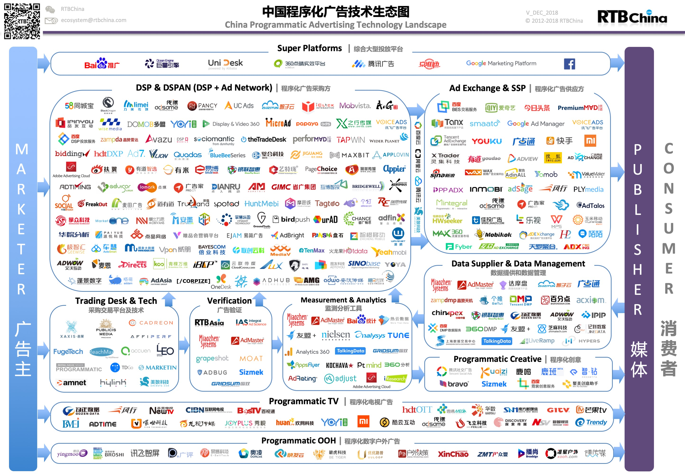

# 计算广告 Computational Advertising

自1993年GNN出售第一个可点击的banner横幅广告开始，互联网广告在全世界拉开了帷幕。1993-1996是启蒙时代，1997-2002是直销时代，2003-2011是网盟时代，2012至今程序化时代。（from：梁丽丽《程序化广告：个性化精准投放实用手册》）。

20余年时间里，互联网广告迅速发展，经历了四个时代，也出现了四种广告模式。四种广告模式分别是，合约广告、广告网络（网盟）、程序化广告、原生广告，四种模式是伴随着互联网广告行业的进步而诞生的，广告行业中的几大角色都是共同推动者。目前，这几种交易模式都是共同存在的，但是行业份额占比不同，目前程序化广告正在迅速发展。

广告是一种商业，那就有它的定价模式，有了定价模式才能形成产业链，通过定价模式在上下游间结算。

常用的定价方式，包括展示类和转化类，展示类常用于品牌广告，转化类常用于效果广告，具体介绍如下。

CPT：Cost Per Time，按时长计费，即按照占据此广告的时长计费，在高价值的广告位上常见，例如开屏广告、跳一跳的广告等

CPM：Cost Per Mille，按展示量计费，即按照此广告的展示次数计费，以品牌展示类为主

CPC：Cost Per Click，按点击量计费，即按照此广告的点击次数计费，关键词竞价常用，例如头条的信息流广告

CPA：Cost Per Action，按行动量计费，即按照某些用户行为次数计费，CPA包括以下CPD、CPI、CPS等

CPD：Cost Per Download，按下载量计费，即按用户完成APP下载计费，APP、游戏等常用

CPI：Cost Per Install，按安装量计费，即按用户激活APP计费，这种比较少，一般是广告主内部衡量效果的指标

CPS：Cost Per Sales，按销售量计费，即按完成订单的用户数量结算，以电商类为主

## SSP, DSP, RTB

### 实时竞价 RTB (Real-time Bidding)

RTB的运作方式并不复杂：当一个用户打开某个网页，这个网页中的广告位信息通过SSP（Supply Side Platform）供应方平台提供给广告交易平台（Ad Exchange），同时，这个用户所用的浏览器获得的Cookies的标签进入DMP（Data Management Platform）管理平台进行分析，将分析所得到的用户属性的标签也传送给Ad Exchange；接下来，Ad Exchange 将这些信息向所有接入到交易平台的广告主或者广告代理商的DSP（Demand Side Platform）需求方平台发出指令，DSP开始向Ad Exchange实时出价，进入RTB模式；经过竞价，用户的属性标签一致，且出价最高的DSP就获得了这次展示广告的机会，广告自动返回到用户的浏览器所打开的这个网页中——这一系列的过程非常快，通常是在80－100毫秒中完成的。

### 需求方平台 DSP (Deman Side Platform)

DSP（Demand Side Platform）是需求方平台，负责接受投放需求，找人群数据，实现投放竞价等功能的那么一个中央管理控制平台。DMP（Data Management Platform）是数据管理平台，负责数据汇集和按需要与DSP进行数据交换。

所以说，DMP是整个DSP的核心，也是智能广告投放的精髓。

## 点击率预估 (CTR)

在计算广告系统中，一个可以携带广告请求的用户流量到达后台时，系统需要在较短时间（一般要求不超过 100ms）内返回一个或多个排序好的广告列表；在广告系统中，一般最后一步的排序 *score = bid * pctr alpha*；其中 *alpha* 参数控制排序倾向，如果*alpha*<1，则倾向于*pctr*，否则倾向于*bid*；这里的核心因子*pctr*就是通常所说的点击率（predicted click through rate）.

点击率预估是计算广告中非常重要的模块，预估一个用户对广告的点击概率，从而提升广告效果。

### 特征表示 Feature Representation

高维、稀疏、多field是输入给CTR预估模型的特征数据的典型特点。

#### Embedding表示

Embedding表示也叫做Distributed representation，起源于神经网络语言模型（NNLM）对语料库中的word的一种表示方法。相对于高维稀疏的one-hot编码表示，embedding-based的方法，学习一个低维稠密实数向量（low-dimensional dense embedding）。类似于hash方法，embedding方法把位数较多的稀疏数据压缩到位数较少的空间，不可避免会有冲突；然而，embedding学到的是类似主题的语义表示，对于item的“冲突”是希望发生的，这有点像软聚类，这样才能解决稀疏性的问题。

Google公司开源的word2vec工具让embedding表示方法广为人知。Embedding表示通常用神经网络模型来学习，当然也有其他学习方法，比如矩阵分解（MF）、因子分解机（FM)等。

### LR模型

将用户是否点击一个物品看成回归问题以后，使用最广泛的模型当属逻辑回归 Logistic Regression。LR模型是广义线性模型，从其函数形式来看，LR模型可以看作是一个没有隐层的神经网络模型（感知机模型）。

LR模型一直是CTR预估问题的benchmark模型，由于其简单、易于并行化实现、可解释性强等优点而被广泛使用。然而由于线性模型本身的局限，不能处理特征和目标之间的非线性关系，因此模型效果严重依赖于算法工程师的特征工程经验。为了让线性模型能够学习到原始特征与拟合目标之间的非线性关系，通常需要对原始特征做一些非线性转换。常用的转换方法包括：**连续特征离散化**、**特征之间的交叉**等。

- **连续特征离散化**
    - 连续特征离散化的方法一般是把原始连续值的值域范围划分为多个区间，比如等频划分或等间距划分，更好的划分方法是利用监督学习的方式训练一个简单的单特征的决策树桩模型，即用信息增益指标来决定分裂点。特征离散化相当于把线性函数变成了分段线性函数，从而引入了非线性结构。
- **特征之间的交叉**
    - 通常CTR预估涉及到用户、物品、上下文等几方面的特征，往往单个特征对目标判定的贡献是较弱的，而不同类型的特征组合在一起就能够对目标的判定产生较强的贡献。比如用户性别和商品类目交叉就能够刻画例如“女性用户偏爱美妆类目”，“男性用户喜欢男装类目”的知识。

LR模型的不足在于特征工程耗费了大量的精力，而且即使有经验的工程师也很难穷尽所有的特征交叉组合。

#### 在线优化算法

求解该类问题最经典的算法是GD（梯度下降法），即沿着梯度方法逐渐优化模型参数。梯度下降法能够保证精度，要想预防过拟合问题一般会加上正则项，L1或者L2正则。

相比于批量GD算法，OGD能够利用实时产生的正负样本，一定程度上能够优化模型效果。在线优化算法需要特殊关注模型鲁棒性和稀疏性，由于样本是一个一个到来，模型参数可能因为训练样本不足导致过拟合等。因此OGD会着重处理模型稀疏性。

### LR+GBDT

模型级联提供了一种思路，典型的例子就是Facebook 2014年的论文中介绍的通过GBDT（Gradient Boost Decision Tree）模型解决LR模型的特征组合问题。思路很简单，特征工程分为两部分，一部分特征用于训练一个GBDT模型，把GBDT模型每颗树的叶子节点编号作为新的特征，加入到原始特征集中，再用LR模型训练最终的模型。

GBDT模型能够学习高阶非线性特征组合，对应树的一条路径（用叶子节点来表示）。通常把一些连续值特征、值空间不大的categorical特征都丢给GBDT模型；空间很大的ID特征（比如商品ID）留在LR模型中训练，既能做高阶特征组合又能利用线性模型易于处理大规模稀疏数据的优势。

### FM(Factorization Machine)因子分解机、FFM(Field-aware Factorizatiion Machine)

因子分解机(Factorization Machines, FM)通过特征对之间的隐变量内积来提取特征组合，其函数形式如下：

FM和基于树的模型（e.g. GBDT）都能够自动学习特征交叉组合。基于树的模型适合连续中低度稀疏数据，容易学到高阶组合。但是树模型却不适合学习高度稀疏数据的特征组合，一方面高度稀疏数据的特征维度一般很高，这时基于树的模型学习效率很低，甚至不可行；另一方面树模型也不能学习到训练数据中很少或没有出现的特征组合。相反，FM模型因为通过隐向量的内积来提取特征组合，对于训练数据中很少或没有出现的特征组合也能够学习到。例如，特征 *i* 和特征 *j* 在训练数据中从来没有成对出现过，但特征 *i* 经常和特征 *p* 成对出现，特征* *j* 也经常和特征 *p* 成对出现，因而在FM模型中特征 *i* 和特征 *j* 也会有一定的相关性。

在推荐系统中，常用矩阵分解（MF）的方法把User-Item评分矩阵分解为两个低秩矩阵的乘积，这两个低秩矩阵分别为User和Item的隐向量集合。通过User和Item隐向量的点积来预测用户对未见过的物品的兴趣。矩阵分解也是生成embedding表示的一种方法，示例图如下：

MF方法可以看作是FM模型的一种特例，即MF可以看作特征只有userId和itemId的FM模型。FM的优势是能够将更多的特征融入到这个框架中，并且可以同时使用一阶和二阶特征；而MF只能使用两个实体的二阶特征。

在二分类问题中，采用LogLoss损失函数时，FM模型可以看做是LR模型和MF方法的融合，如下图所示：

FFM（Field-aware Factorization Machine）模型是对FM模型的扩展，通过引入field的概念，FFM把相同性质的特征归于同一个field。例如，“Day=26/11/15”、 “Day=1/7/14”、 “Day=19/2/15”这三个特征都是代表日期的，可以放到同一个field中。在FFM中，每一维特征 *xi* ，针对其它特征的每一种field *fj* ，都会学习一个隐向量 *vifj* 。因此，隐向量不仅与特征相关，也与field相关。假设样本的*n*个特征属于*f*个field，那么FFM的二次项有*nf*个隐向量。

FM可以看作FFM的特例，在FM模型中，每一维特征的隐向量只有一个，即FM是把所有特征都归属到一个field时的FFM模型。

### 混合逻辑回归（MLR）

MLR算法是alibaba在2012年提出并使用的广告点击率预估模型，2017年发表出来。MLR模型是对线性LR模型的推广，它利用分片线性方式对数据进行拟合。基本思路是采用分而治之的策略：如果分类空间本身是非线性的，则按照合适的方式把空间分为多个区域，每个区域里面可以用线性的方式进行拟合，最后MLR的输出就变为了多个子区域预测值的加权平均。如下图(C)所示，就是使用4个分片的MLR模型学到的结果。

上式即为MLR的目标函数，其中 m 为分片数（当 m=1 时，MLR退化为LR模型）； 是聚类参数，决定分片空间的划分，即某个样本属于某个特定分片的概率； 是分类参数，决定分片空间内的预测； 和  都是待学习的参数。最终模型的预测值为所有分片对应的子模型的预测值的期望。

MLR模型在大规模稀疏数据上探索和实现了非线性拟合能力，在分片数足够多时，有较强的非线性能力；同时模型复杂度可控，有较好泛化能力；同时保留了LR模型的自动特征选择能力。

MLR模型的思路非常简单，难点和挑战在于MLR模型的目标函数是非凸非光滑的，使得传统的梯度下降算法并不适用。相关的细节内容查询论文：Gai et al, “Learning Piece-wise Linear Models from Large Scale Data for Ad Click Prediction”。

另一方面，MLR模型可以看作带有一个隐层的神经网络。如下图， *x*是大规模的稀疏输入数据，MLR模型第一步是做了一个Embedding操作，分为两个部分，一种叫聚类Embedding（绿色），另一种是分类Embedding（红色）。两个投影都投到低维的空间，维度为*m* ，是MLR模型中的分片数。完成投影之后，通过很简单的内积（Inner Product）操作便可以进行预测，得到输出 *y* 。

### Wide & Deep Learning (WDL)

像LR这样的wide模型学习特征与目标之间的直接相关关系，偏重记忆（memorization），如在推荐系统中，wide模型产生的推荐是与用户历史行为的物品直接相关的物品。这样的模型缺乏刻画特征之间的关系的能力，比如模型无法感知到“土豆”和“马铃薯”是相同的实体，在训练样本中没有出现的特征组合自然就无法使用，因此可能模型学习到某种类型的用户喜欢“土豆”，但却会判定该类型的用户不喜欢“马铃薯”。

WDL是Google在2016年的paper中提出的模型，其巧妙地将传统的特征工程与深度模型进行了强强联合。模型结构如下:

WDL分为wide和deep两部分联合训练，单看wide部分与LR模型并没有什么区别；deep部分则是先对不同的ID类型特征做embedding，在embedding层接一个全连接的MLP（多层感知机），用于学习特征之间的高阶交叉组合关系。由于Embedding机制的引入，WDL相对于单纯的wide模型有更强的泛化能力。

### FNN (Factorization-machine supported Neural Network)

除了神经网络模型，FM模型也可以用来学习到特征的隐向量（embedding表示），因此一个自然的想法就是先用FM模型学习到特征的embedding表示，再用学到的embedding向量代替原始特征作为最终模型的特征。这个思路类似于LR+GBDT，整个学习过程分为两个阶段：第一个阶段先用一个模型做特征工程；第二个阶段用第一个阶段学习到新特征训练最终的模型。

FNN模型就是用FM模型学习到的embedding向量初始化MLP，再由MLP完成最终学习，其模型结构如下：

### PNN (Product-based Neural Networks)

MLP中的节点add操作可能不能有效探索到不同类别数据之间的交互关系，虽然MLP理论上可以以任意精度逼近任意函数，但越泛化的表达，拟合到具体数据的特定模式越不容易。PNN主要是在深度学习网络中增加了一个inner/outer product layer，用来建模特征之间的关系。

Embedding Layer和Product Layer之间的权重为常量1，在学习过程中不更新。Product Layer的节点分为两部分，一部分是*z*向量，另一部分是*p*向量。 *z*向量的维数与输入层的Field个数（ *N* ）相同， 。 *p*向量的每个元素的值由embedding层的feature向量两两成对并经过Product操作之后生成， ，因此*p*向量的维度为。这里的*fi*是field *i* 的embedding向量， ，其中*x*是输入向量，是field *i* 的one-hot编码向量。

这里所说的Product操作有两种：内积和外积；对应的网络结构分别为IPNN和OPNN，两者的区别如下图。

在IPNN中，由于Product Layer的 p 向量由field两两配对产生，因此维度膨胀很大，给 l_1 Layer的节点计算带来了很大的压力。受FM启发，可以把这个大矩阵转换分解为小矩阵和它的转置相乘，表征到低维度连续向量空间，来减少模型复杂度： 

在OPNN中，外积操作带来更多的网络参数，为减少计算量，使得模型更易于学习，采用了多个外积矩阵按元素叠加（element-wise superposition）的技巧来减少复杂度，具体如下： 

### DeepFM

深度神经网络对于学习复杂的特征关系非常有潜力。目前也有很多基于CNN与RNN的用于CTR预估的模型。但是基于CNN的模型比较偏向于相邻的特征组合关系提取，基于RNN的模型更适合有序列依赖的点击数据。

FNN模型首先预训练FM，再将训练好的FM应用到DNN中。PNN网络的embedding层与全连接层之间加了一层Product Layer来完成特征组合。PNN和FNN与其他已有的深度学习模型类似，都很难有效地提取出低阶特征组合。WDL模型混合了宽度模型与深度模型，但是宽度模型的输入依旧依赖于特征工程。上述模型要不然偏向于低阶特征或者高阶特征的提取，要不然依赖于特征工程。而DeepFM模型可以以端对端的方式来学习不同阶的组合特征关系，并且不需要其他特征工程。

DeepFM的结构中包含了因子分解机部分以及深度神经网络部分，分别负责低阶特征的提取和高阶特征的提取。其结构如下：

上图中红色箭头所表示的链接权重恒定为1（weight-1 connection），在训练过程中不更新，可以认为是把节点的值直接拷贝到后一层，再参与后一层节点的运算操作。

与Wide&Deep Model不同，DeepFM共享相同的输入与embedding向量。在Wide&Deep Model中，因为在Wide部分包含了人工设计的成对特征组，所以输入向量的长度也会显著增加，这也增加了复杂性。

DeepFM包含两部分：神经网络部分与因子分解机部分。这两部分共享同样的输入。对于给定特征*i*，向量*wi*用于表征一阶特征的重要性，隐变量*Vi*用于表示该特征与其他特征的相互影响。在FM部分，*Vi*用于表征二阶特征，同时在神经网络部分用于构建高阶特征。所有的参数共同参与训练。DeepFM的预测结果可以写为
其中是预测的点击率，与分别是FM部分与DNN部分。

FM部分的详细结构如下：

FM的输出如下公式：

其中。加法部分反映了一阶特征的重要性，而内积部分反应了二阶特征的影响。

深度部分详细如下：

深度部分是一个前馈神经网络。与图像或者语音这类输入不同，图像语音的输入一般是连续而且密集的，然而用于CTR的输入一般是及其稀疏的。因此需要设计特定的网络结构，具体实现为，在第一层隐含层之前，引入一个嵌入层来完成将输入向量压缩到低维稠密向量。

其中*H*是隐层的层数。

### FTRL

FTRL 是从 RDA、FOBOS 等针对 LR 的在线学习算法改进而来，主要是工业界强烈的在线学习的需求驱动而来。

在线学习背后的理念是每个人的兴趣是 non-stationary 的，离线训练的模型在线上可能不能快速对用户最新的行为作出反应。为了解决这个问题，一种做法是我们加快模型的频率，比如原来一天更新一次，现在一个小时更新一次，这种做法有很明显的瓶颈，比如如果我们的时间窗设置的比较长，用一个月或者两个月数据来跑模型，则可能导致模型在更新间隙内完不成训练；如果我们采用增量训练的方式，则增量时间窗的设置是个技术活，太短，很多曝光对应的点击还没有上来，导致训练数据的无效曝光比例偏高，如果太长，可能跟不上节奏；这也是在线学习的一个难点，在线学习一般也不会每一个回流数据立马更新模型，这会导致模型震荡频繁，攒一小段时间是个不错的选择，为此 Facebook 的系统里有一个 online joiner 的组件来做曝光和点击的归约。

从今日头条披露的资料来看，在模型更新方面他们采用了增量更新 + 定时校准的策略；类似于在线学习 + 定时离线校准。这种策略应该也可以用到点击率的场景。

在线学习另外一个要重点解决的问题是学习率；离线训练的时候 sgd 往往使用一个公用的学习率η，但是在线学习这样做会带来问题；因为样本分布不均衡，某些覆盖不是很高的特征对应的权重因为样本少得到的更新次数比较少，如果使用相同的学习率，则这些权重的收敛势必落后于覆盖率高的样本的特征对应的权重，尤其是有做学习率衰减的情况下；因此我们需要针对不同的权重来设置不同的学习率，做法也比较简单，基本思路是统计该维度样本数，多的衰减快点，少的衰减慢点以期能做到基本持平。

FTRL 主要是针对 LR 部分的 online learning；GBDT+LR 是两种不同模型的级联，这两个方案是可以很方便的糅合在一起的变成 GBDT+FTRL-LR；但这里 GBDT 的更新没法做到 online learning；可以做定期更新。理论上这种做法可能会效果更好一点。

### DIN

DIN是阿里17年的论文中提出的深度学习模型，该模型基于对用户历史行为数据的两个观察：1、多样性，一个用户可能对多种品类的东西感兴趣；2、部分对应，只有一部分的历史数据对目前的点击预测有帮助，比如系统向用户推荐泳镜时会与用户点击过的泳衣产生关联，但是跟用户买的书就关系不大。于是，DIN设计了一个attention结构，对用户的历史数据和待估算的广告之间部分匹配，从而得到一个权重值，用来进行embedding间的加权求和。

DIN模型的输入分为2个部分：用户特征和广告(商品)特征。用户特征由用户历史行为的不同实体ID序列组成。在对用户的表示计算上引入了attention network (也即图中的Activation Unit) 。DIN把用户特征、用户历史行为特征进行embedding操作，视为对用户兴趣的表示，之后通过attention network，对每个兴趣表示赋予不同的权值。这个权值是由用户的兴趣和待估算的广告进行匹配计算得到的，如此模型结构符合了之前的两个观察：用户兴趣的多峰分布以及部分对应。Attention network 的计算公式如下，

其中，代表用户表示向量， 是用户行为的embedding向量，代表广告的表示向量。核心在于用户的表示向量不仅仅取决于用户的历史行为，而且还与待评估的广告有直接的关联。

### 评价指标

#### AUC

AUC 是 ROC 曲线下的面积，是一个 [0,1] 之间的值。他的优点是用一个值概括出模型的整体 performance，不依赖于阈值的选取。因此 AUC 使用很广泛，既可以用来衡量不同模型，也可以用来调参。

AUC 指标的不足之处有两点：一是只反映了模型的整体性能，看不出在不同点击率区间上的误差情况；二是只反映了排序能力，没有反映预测精度。 简单说，如果对一个模型的点击率统一乘以 2，AUC 不会变化，但显然模型预测的值和真实值之间的 offset 扩大了。

### RMSE

Netflix 比赛用的 RMSE 指标可以衡量预测的精度，与之类似的指标有 MSE、MAE。

#### RIG

这里要强调的一点是 RIG 指标不仅和模型的质量有关，还和数据集的分布情况有关；因此千万注意不可以使用 RIG 来对比不同数据集上生成的模型，但可以用来对比相同数据集上不同模型的质量差异。这一点尤为重要。

### 总结

主流的CTR预估模型已经从传统的宽度模型向深度模型转变，与之相应的人工特征工程的工作量也逐渐减少。上文提到的深度学习模型，除了DIN对输入数据的处理比较特殊之外，其他几个模型还是比较类似的，它们之间的区别主要在于网络结构的不同，如下图所示: 

### 新广告：lookalike、相关广告信息挖掘

新广告的点击率预测是另一个比较大的话题，这里我先简单分为两类，一类是临时性投放，比如某个新广告主偶然来试投一下汽车广告。如果广告主能提供一批种子用户，我们可以使用 lookalike 的方法来优化之，可以参考 fandy 的 [15]，我的理解是一个迭代处理，先基于种子用户和采样用户训练一个 model，然后用 model 对采样的用户做一轮 predict，把得分高的用户刨除掉，剩下的用户定义为有效负用户，然后再和种子用户一起训练一个新的 model，将这个 model 作为候选 predict 并圈取用户的指示器。

另一类新广告是广告主或者代理商在广告投放系统里投放的一个新的素材，这个时候虽然广告是全新的，但是我们任然可以从系统里挖掘出大量相关的信息，比如该广告对应的 pushlisher 的历史信息，对应的 advertiser 的信息，对应类比的信息等，具体可以参考 [14]。

### Rare Event：贝叶斯平滑、指数平滑

想法的初衷是我们经常需要使用一些点击率特征，比如曝光两次点击一次我们可以得出 0.5 点击率，另一个广告是曝光一万次，点击五千次，也可以得到 0.5 的点击率，但是这两个 0.5 代表的意义能一样吗？前者随着曝光的增加，有可能会快速下滑，为了解决经验频率和概率之间的这种差异，我们引入平滑的技巧。

## 书籍 Books 

- **计算广告：互联网商业变现的市场与技术**，刘鹏，王超著

## 论文

计算广告领域的Paper List: [https://github.com/wnzhang/rtb-papers/](https://github.com/wnzhang/rtb-papers/)

### CTR预估

1. Google在CTR预估领域的工程实践经验 [Ad Click Prediction: A View From the Trenches](papers/AdClickPrediction_Google_KDD2013.md)
2. Google的Wide&Deep [Wide & Deep Learning for Recommender Systems](papers/Wide_Deep.md)

## 技术

### 协同过滤 Collaborative Filtering

Amazon在2001年提出的用于推荐领域的一个算法，是推荐领域最经典的算法之一。

在实际场景中可以将用户对于Item的评分/购买/点击等行为 形成一张user-item的矩阵，单个的User或者Item可以通过对于有交互的Item和User来表示(最简单的就是One-Hot向量)，通过各种相似度算法可以计算到User2User、Item2Item以及User2Item的最近邻，先就假设按User2Item来说:

1. 和你购买相似宝贝的用户,其实和你相近的，也同时认为你们的习惯是相似的，
2. 因此他们买的其他的宝贝你也是可能会去够买的，这批宝贝就可以认为和你相似的

但是传统的CF会存在这两个问题:

1. 往往这个矩阵会非常稀疏，大部分稀疏程度在95%以上，甚至会超时99%，这样在计算相似度时就非常不准确了（置信度很低）
2. 整个求最近邻过程中会引入很多Trick，比如平滑、各种阈值等,最终将CF拿到效果还是比较难的。
3. 另外还有一个就是冷启动的问题，新用户或者新的item没法直接使用这种方式来计算。

### 参考论文

1. [Predicting Clicks: Estimating the Click-Through Rate for New Ads](./papers/PredictingClicks.md)
2. [Web-Scale Bayesian Click-Through Rate Prediction for Sponsored Search Advertising in Microsoft’s Bing Search Engine](./papers/BayesianCTR.md)
3. [Practical Lessons from Predicting Clicks on Ads at Facebook](./papers/PracticalFacebook.md)
4. [Greedy function approximation:a gradient boosting machine]
5. [Ad Click Prediction: a View from the Trenches](./papers/AdClickPrediction_Google_KDD2013.md)
6. [Factorization Machines]
7. [An Empirical Evaluation of Thompson Sampling]
8. [Content-based Recommendation Systems]
9. [Click-Through Rate Estimation for Rare Events in Online Advertising]
10. [Wide & Deep Learning for Recommender System]
11. [Deep Neural Networks for YouTube Recommendations]
12. [Predictive Model Performance: Offline and Online Evaluations]
13. [Personalized Click Prediction in Sponsored Search](./papers/coec.md)

### 参考链接

1. InfoQ：从逻辑回归到深度学习，点击率预测技术面面观 [https://www.infoq.cn/article/click-through-rate-prediction](https://www.infoq.cn/article/click-through-rate-prediction)
2. Collaborative Filtering: [http://kubicode.me/2019/01/16/Deep%20Learning/Collaborative-Filtering-Meet-to-Deep-Learning/#more](http://kubicode.me/2019/01/16/Deep%20Learning/Collaborative-Filtering-Meet-to-Deep-Learning/#more)
3.  Ad Click Prediction: a View from the Trenches笔记[https://blog.csdn.net/fangqingan_java/article/details/51020653](https://blog.csdn.net/fangqingan_java/article/details/51020653)
4. 知乎：广告ctr预估有什么值得推荐的论文？[https://www.zhihu.com/question/26154847](https://www.zhihu.com/question/26154847)
5. 知乎：主流CTR预估模型的演化及对比 [https://zhuanlan.zhihu.com/p/35465875](https://zhuanlan.zhihu.com/p/35465875)
6. Github上关于计算广告的整理
    - [https://github.com/wzhe06/Ad-papers](https://github.com/wzhe06/Ad-papers)
    - [https://github.com/wnzhang/rtb-papers/](https://github.com/wnzhang/rtb-papers/)
7. 代码实现
    - LR, GBDT，RF，NN，PNN等几种CTR预估模型的spark实现 [https://github.com/wzhe06/CTRmodel](https://github.com/wzhe06/CTRmodel)
    - 可以直接使用的Deep CTR模型：DeepFM, DIN, DIEN, DCN, AFM, NFM, AutoInt, DSIN [https://github.com/shenweichen/DeepCTR](https://github.com/shenweichen/DeepCTR)