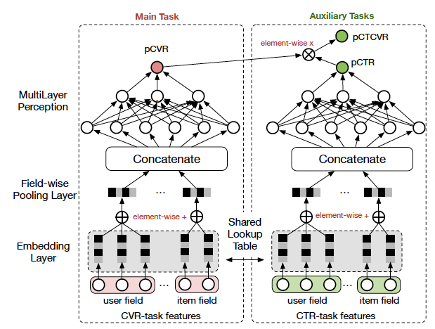

ctr, cvr, click/install/purchase

# 基础概念

- Bidding 计费模式
  - CPA (Cost Per Action)
    - 按照行为（Action）来计费
  - CPC（Cost Per Click）
    - 按照点击次数（Click）来计费
- Evaluation 衡量指标
  - CTR 点击率 $=\frac{No.Clicks}{No.Impressions}$
  - CVR 转化率 $=\frac{No.Conversions}{No.Clicks}$

# CTR模型

# CVR模型

CVR转化问题是推荐系统，计算广告领域一个比较核心的问题。如何做好CVR转化对于产品变现是非常重要的。

## 基本思考

- 样本
  - 训练样本
    - 用户点击后购买/安装的作为正样本
    - 用户点击后未购买/安装的作为负样本
  - 线上预测样本
    - 用户的曝光样本

## ESMM

- 难点
  - 样本在训练与预测时不一致
  - 数据稀疏
- 思想
  - 分为一个main task和一个auxiliary task其中main task依然是传统的cvr转化模型，auxiliary task通过shared lookup table与main task共享embedding层这样可以一定程度上缓解数据稀疏导致的embeding学习表达较弱的问题，auxiliary task是一个ctr预估模型，其主要用到了impression数据，通过cvr和ctr的乘法运算学习ctcvr，这种同时约束cvr和ctr的方式可以为main task模型带来一些impression相关的数据信息，解决了样本分布不一致的问题。

# 经典论文

| Model | Paper | Affiliation |	Key Takeaways |
| ---- | ---- | ---- | ---- |
| LR+GBDT | [Practical lessons from predicting clicks on ads at facebook](https://research.facebook.com/file/273183074306353/practical-lessons-from-predicting-clicks-on-ads-at-facebook.pdf) (ADKDD 2014) | Meta | `LR+GBDT`   1. Data freshness很重要，模型至少每天训练一次;   2. 使用boosted decision tree进行特征转换提高了模型性能;   3. 在线学习：LR+per-coordinate learning rate |
| DNN  | [Deep Neural Networks for YouTube Recommendations](https://static.googleusercontent.com/media/research.google.com/en//pubs/archive/45530.pdf) (RecSys 2016) | Youtube |  |
| | | | |
| Wide&Deep | [Wide & Deep Learning for Recommender Systems](https://arxiv.org/pdf/1606.07792.pdf) (DLRS 2016) | Google | 	1. Wide模型提供记忆能力；  2. Deep模型提供泛化能力；   3. Wide&Deep联合训练 |
| DeepFM | [DeepFM: An End-to-End Wide & Deep Learning Framework for CTR Prediction](http://www.ijcai.org/proceedings/2017/0239.pdf) (IJCAI 2017) | Huawei | |
| | [Real-time Personalization using Embeddings for Search Ranking at Airbnb] (KDD 2018) | Airbnb | |
| | [Entire Space Multi-Task Model: An Effective Approach for Estimating Post-Click Conversion Rate] | | |
| | [Real-time Personalization using Embeddings for Search Ranking at Airbnb] | Airbnb |  |
| DIN | [Deep Interest Network for Click-Through Rate Prediction](https://arxiv.org/pdf/1706.06978.pdf) (KDD 2018) | Alibaba | 1. Local Activation Unit: 自适应地根据candidate来表征用户的兴趣。类似attention；   2. 正则化对稀疏特征优化 |
| | [Practice on Long Sequential User Behavior Modeling for Click-Through Rate Prediction](https://arxiv.org/pdf/1905.09248.pdf) (2019) | Alibaba | |
| SIM | [Search-based User Interest Modeling with Sequential Behavior Data for CTR Prediction](https://arxiv.org/pdf/2006.05639.pdf) (2020) | Alibaba | |
| | [Using deep learning to detect abusive sequences of member activity](https://engineering.linkedin.com/blog/2021/using-deep-learning-to-detect-abusive-sequences-of-member-activi) ([Video](https://exchange.scale.com/public/videos/using-deep-learning-to-detect-abusive-sequences-of-member-activity-on-linkedin)) (2021) | LinkedIn | |
| | [Entire Space Multi-Task Model: An Effective Approach for Estimating Post-Click Conversion Rate](https://arxiv.org/pdf/1804.07931) (SIGIR 2018) | Alibaba | |
| | Progressive Layered Extraction (PLE): A Novel Multi-Task Learning (MTL) Model for Personalized Recommendation | | |
| | Estimating Conversion Rate in Display Advertising from Past Performance Data | | |
| | | | |