- [主流CTR模型演化](#主流ctr模型演化)
  - [深度CTR模型的基本框架](#深度ctr模型的基本框架)
  - [Logistic Regression](#logistic-regression)
  - [LR + GBDT](#lr--gbdt)
  - [Product-based Neural Networks](#product-based-neural-networks)
  - [Wide \& Deep](#wide--deep)
  - [DeepFM](#deepfm)
  - [Deep \& Cross Network (DCN)](#deep--cross-network-dcn)
  - [xDeepFM](#xdeepfm)
  - [Deep Interest Network](#deep-interest-network)
  - [DCN V2](#dcn-v2)
- [工程问题](#工程问题)
  - [线上serving](#线上serving)
- [评价指标](#评价指标)
  - [COPC](#copc)
  - [AUC](#auc)
  - [Logloss](#logloss)
  - [GAUC](#gauc)
- [其他](#其他)
  - [点击率预估 (CTR)](#点击率预估-ctr)
    - [特征表示 Feature Representation](#特征表示-feature-representation)
      - [Embedding表示](#embedding表示)
    - [FM(Factorization Machine)因子分解机、FFM(Field-aware Factorizatiion Machine)](#fmfactorization-machine因子分解机ffmfield-aware-factorizatiion-machine)
    - [混合逻辑回归（MLR）](#混合逻辑回归mlr)
    - [Wide \& Deep Learning (WDL)](#wide--deep-learning-wdl)
    - [FNN (Factorization-machine supported Neural Network)](#fnn-factorization-machine-supported-neural-network)
    - [PNN (Product-based Neural Networks)](#pnn-product-based-neural-networks)
    - [DeepFM](#deepfm-1)
    - [FTRL](#ftrl)
    - [DIN](#din)
    - [评价指标](#评价指标-1)
      - [AUC](#auc-1)
    - [RMSE](#rmse)
      - [RIG](#rig)
    - [总结](#总结)
    - [新广告：lookalike、相关广告信息挖掘](#新广告lookalike相关广告信息挖掘)
    - [Rare Event：贝叶斯平滑、指数平滑](#rare-event贝叶斯平滑指数平滑)
- [参考](#参考)

# 主流CTR模型演化

CTR预估本质是一个二分类问题，以移动端展示广告推荐为例，依据日志中的用户侧的信息（比如年龄，性别，国籍，手机上安装的app列表）、广告侧的信息（广告id，广告类别，广告标题等）、上下文侧信息（渠道id等），去建模预测用户是否会点击该广告。在CPC（cost-per-click）的广告系统中，广告是通过eCPM（effective cost per mille）来排序的，而eCPM是竞价（bid price）和CTR（click-through rate）的乘积。

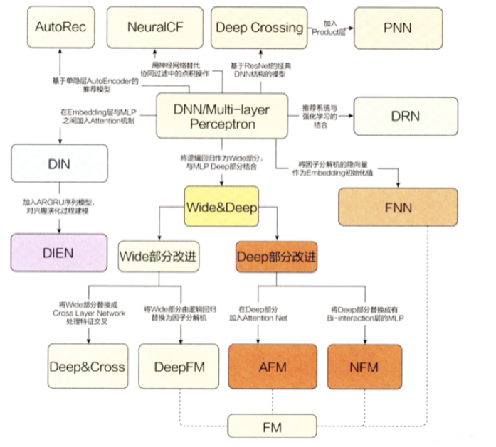

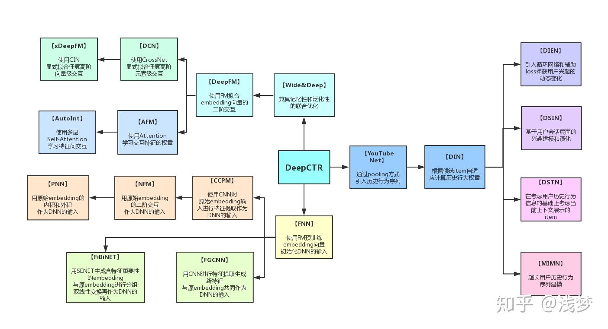

| Model | Paper | Affiliation | Key Takeaways |  
| ---- | ---- | ---- | ---- |
| GBDT&LR | [Practical Lessons from Predicting Clicks on Ads at Facebook](https://research.facebook.com/file/273183074306353/practical-lessons-from-predicting-clicks-on-ads-at-facebook.pdf) [ADKDD 2014] | Meta | `LR+GBDT` <br> 1. Data freshness很重要，模型至少每天训练一次; <br> 2. 使用boosted decision tree进行特征转换提高了模型性能; <br> 3. 在线学习：LR+per-coordinate learning rate <br> [[Detailed Notes]](#lr--gbdt) | 
| Convolutional Click Prediction Model  | [A Convolutional Click Prediction Model](http://ir.ia.ac.cn/bitstream/173211/12337/1/A%20Convolutional%20Click%20Prediction%20Model.pdf) [CIKM 2015]  | | |
| Factorization-supported Neural Network | [Deep Learning over Multi-field Categorical Data: A Case Study on User Response Prediction](https://arxiv.org/pdf/1601.02376.pdf) [ECIR 2016] |   |     |
| Product-based Neural Network  | [Product-based neural networks for user response prediction](https://arxiv.org/pdf/1611.00144.pdf) [ICDM 2016] | SJTU & UCL | [[Detailed Notes]](#product-based-neural-networks) |
| Wide & Deep | [Wide & Deep Learning for Recommender Systems](https://arxiv.org/pdf/1606.07792.pdf) [DLRS 2016] | Google  |  1. Wide模型提供记忆能力；<br> 2. Deep模型提供泛化能力；<br> 3. Wide&Deep联合训练 <br>[[Detailed Notes]](#wide--deep)  |
|  DeepFM  | [DeepFM: A Factorization-Machine based Neural Network for CTR Prediction](http://www.ijcai.org/proceedings/2017/0239.pdf) [IJCAI 2017] | Huawei | `Wide&Deep升级版` <br> 1. 将浅层部分的LR替换为FM；<br> 2. 浅层部分和深层部分共享输入; <br> 3. End-to-End，不需要人工特征工程 <br> [[Detailed Notes]](#deepfm) |
|  Piece-wise Linear Model   | [Learning Piece-wise Linear Models from Large Scale Data for Ad Click Prediction](https://arxiv.org/abs/1704.05194) [arxiv 2017]  | | |
|  Deep & Cross Network  | [Deep & Cross Network for Ad Click Predictions](https://arxiv.org/abs/1708.05123) [ADKDD 2017] | Google |  `Wide&Deep进化版` <br> 将Wide部分替换为Cross，自动构造高阶交叉特征 <br> [[Detailed Notes]](#deep--cross-network-dcn)  |
|  Attentional Factorization Machine | [Attentional Factorization Machines: Learning the Weight of Feature Interactions via Attention Networks](http://www.ijcai.org/proceedings/2017/435) [IJCAI 2017] | | |
|  Neural Factorization Machine  | [Neural Factorization Machines for Sparse Predictive Analytics](https://arxiv.org/pdf/1708.05027.pdf) [SIGIR 2017]  | | |
|  xDeepFM | [xDeepFM: Combining Explicit and Implicit Feature Interactions for Recommender Systems](https://arxiv.org/pdf/1803.05170.pdf) [KDD 2018] | Microsoft | `DCN升级版` <br> 1. 联合学习显式和隐式的高阶特征组合，无需人工特征工程; <br> 2. 压缩交互网络（CIN， Compressed Interaction Network）用来显式学习高阶特征组合 <br>  [[Detailed Notes]](#xdeepfm) |
|  Deep Interest Network  | [Deep Interest Network for Click-Through Rate Prediction](https://arxiv.org/pdf/1706.06978.pdf) [KDD 2018] | Alibaba | 1. Local Activation Unit: 自适应地根据candidate来表征用户的兴趣。类似attention； <br> 2. 正则化对稀疏特征优化 <br> [[Detailed Notes]](#deep-interest-network)  | 
|  Deep Interest Evolution Network | [Deep Interest Evolution Network for Click-Through Rate Prediction](https://arxiv.org/pdf/1809.03672.pdf) [AAAI 2019] | | |
|  AutoInt | [AutoInt: Automatic Feature Interaction Learning via Self-Attentive Neural Networks](https://arxiv.org/abs/1810.11921) [CIKM 2019]  | | |
|  ONN   | [Operation-aware Neural Networks for User Response Prediction](https://arxiv.org/pdf/1904.12579.pdf) [arxiv 2019]  |  | |
|  FiBiNET  | [FiBiNET: Combining Feature Importance and Bilinear feature Interaction for Click-Through Rate Prediction](https://arxiv.org/pdf/1905.09433.pdf) [RecSys 2019] | | |
|  IFM  | [An Input-aware Factorization Machine for Sparse Prediction](https://www.ijcai.org/Proceedings/2019/0203.pdf) [IJCAI 2019] |  | |
|  DCN V2 | [DCN V2: Improved Deep & Cross Network and Practical Lessons for Web-scale Learning to Rank Systems](https://arxiv.org/abs/2008.13535) [arxiv 2020]  | | |
|  DIFM  | [A Dual Input-aware Factorization Machine for CTR Prediction](https://www.ijcai.org/Proceedings/2020/0434.pdf) [IJCAI 2020] |  | |
|  AFN  | [Adaptive Factorization Network: Learning Adaptive-Order Feature Interactions](https://arxiv.org/pdf/1909.03276) [AAAI 2020]  | | |
|  SharedBottom  | [An Overview of Multi-Task Learning in Deep Neural Networks](https://arxiv.org/pdf/1706.05098.pdf) [arxiv 2017] | | |
|  ESMM | [Entire Space Multi-Task Model: An Effective Approach for Estimating Post-Click Conversion Rate](https://dl.acm.org/doi/10.1145/3209978.3210104) [SIGIR 2018]  |  | |
|  MMOE | [Modeling Task Relationships in Multi-task Learning with Multi-gate Mixture-of-Experts](https://dl.acm.org/doi/abs/10.1145/3219819.3220007) [KDD 2018] |   | |
| PLE  | [Progressive Layered Extraction (PLE): A Novel Multi-Task Learning (MTL) Model for Personalized Recommendations](https://dl.acm.org/doi/10.1145/3383313.3412236) [RecSys 2020]  |  |    |
| SIM | [Search-based User Interest Modeling with Lifelong Sequential Behavior Data for Click-Through Rate Prediction](https://arxiv.org/pdf/2006.05639) [CIKM 2020] | | |  


## 深度CTR模型的基本框架


典型的深度CTR模型可以分成以下四个部分：`输入`、`特征嵌入（Embedding）`、`特征交互`（有时候也称为特征提取）和`输出`。

- `输入`
  - 输入通常包含若干个<特征ID, 特征值>对，当然也可以One-Hot Encoding展开。
- `特征嵌入（Embedding)`
  - 在CTR任务中数据特征呈现高维、稀疏的特点，假设特征数为N，直接将这些特征进行One-Hot Encoding构造二阶及以上特征时候会产生巨大的参数数量，以FM的二阶项为例子，如一万个特征，两两构造二阶特征时将会产生一亿规模的特征权重参数。
  - Embedding可以减小模型复杂度，具体过程如下：通过矩阵乘法将$1\times N$的离散特征向量通过维度为$N\times k$的参数矩阵$W$压缩成$1\times k$的低维度稠密向量，通常$k\ll N$，参数从$N^2$降到$N\times k$。
- `特征交互`
  - 经过特征嵌入可以获得稠密向量，在特征交互模块中设计合理的模型结构将稠密向量变成标量，该模块直接决定模型的质量好坏。
- `输出`
  - 将特征交互模块输出的标量用sigmoid函数映射到[0, 1]，即表示CTR。

Embedding+MLP 是对于分领域离散特征进行深度学习 CTR 预估的通用框架。深度学习在特征组合挖掘（特征学习）方面具有很大的优势。比如以 CNN 为代表的深度网络主要用于图像、语音等稠密特征上的学习，以 W2V、RNN 为代表的深度网络主要用于文本的同质化、序列化高维稀疏特征的学习。CTR 预估的主要场景是对离散且有具体领域的特征进行学习，所以其深度网络结构也不同于 CNN 与 RNN。 

具体来说，Embedding+MLP 的过程如下： 

1. 对不同领域的 one-hot 特征进行嵌入（embedding），使其降维成低维度稠密特征。 
2. 然后将这些特征向量拼接（concatenate）成一个隐含层。 
3. 之后再不断堆叠全连接层，也就是多层感知机（Multilayer Perceptron, MLP，有时也叫作前馈神经网络）。 
4. 最终输出预测的点击率。 

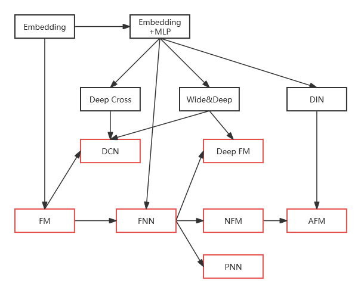

## Logistic Regression

将用户是否点击一个物品看成回归问题以后，使用最广泛的模型当属逻辑回归 Logistic Regression。LR模型是广义线性模型，从其函数形式来看，LR模型可以看作是一个没有隐层的神经网络模型（感知机模型）。

LR模型一直是CTR预估问题的benchmark模型，由于其简单、易于并行化实现、可解释性强等优点而被广泛使用。然而由于线性模型本身的局限，不能处理特征和目标之间的非线性关系，因此模型效果严重依赖于算法工程师的特征工程经验。为了让线性模型能够学习到原始特征与拟合目标之间的非线性关系，通常需要对原始特征做一些非线性转换。常用的转换方法包括：**连续特征离散化**、**特征之间的交叉**等。

- **连续特征离散化**
    - 连续特征离散化的方法一般是把原始连续值的值域范围划分为多个区间，比如等频划分或等间距划分，更好的划分方法是利用监督学习的方式训练一个简单的单特征的决策树桩模型，即用信息增益指标来决定分裂点。特征离散化相当于把线性函数变成了分段线性函数，从而引入了非线性结构。
- **特征之间的交叉**
    - 通常CTR预估涉及到用户、物品、上下文等几方面的特征，往往单个特征对目标判定的贡献是较弱的，而不同类型的特征组合在一起就能够对目标的判定产生较强的贡献。比如用户性别和商品类目交叉就能够刻画例如“女性用户偏爱美妆类目”，“男性用户喜欢男装类目”的知识。

LR模型的不足在于特征工程耗费了大量的精力，而且即使有经验的工程师也很难穷尽所有的特征交叉组合。

```python
class LogisticRegression(nn.Module):
    """
        LR
    """
    def __init__(self, feature_fields):
        super(LogisticRegression, self).__init__()
        self.feature_fields = feature_fields
        
        self.linear = torch.nn.Embedding(sum(feature_fields)+1, 1)
        self.bias = torch.nn.Parameter(torch.zeros((1,)))     
        self.offset = np.array((0, *np.cumsum(feature_fields)[:-1]), dtype = np.long)
        
    def forward(self, x):
        x = x + x.new_tensor(self.offset).unsqueeze(0)
        x = torch.sum(self.linear(x), dim = 1) + self.bias
        x = torch.sigmoid(x.squeeze(1))
        return x
```

## LR + GBDT

GBDT(Gradient Boost Decision Tree)是用来解决LR模型的特征组合问题。GBDT可以用来学习高阶非线性特征组合。对应树的一条路径。通常将一些连续值特征、值空间不大的categorical特征都丢给GBDT模型；空间很大的ID特征留在LR模型中训练，既能做高阶特征组合又可以利用线性模型易于处理大规模稀疏数据的优势。

$f(x)=logistics(gbdtree_1(X) gbdtree_2(X) ...)$

GBDT优势在于处理连续值特征，如用户历史点击率、用户历史浏览次数等连续值。由于树的分裂算法，具有一定组合特征的能力。GBDT根据最优的分裂特征和该特征的最优分裂点，根据特征的分裂次数得到一个特征的重要性排序，GBDT减少了人工特征工程的工作量。

但是大多数推荐系统中出现的是大规模的离散化特征，使用GBDT需要首先统计成连续值特征(embedding)，需要耗费时间，GBDT具有记忆性强的特点，不利于挖掘长尾特征。而且GBDT虽然具有一定组合特征能力，但是组合的能力十分有限，远不能与DNN相比。

- **模型**
  - 决策树特征转换（Decision tree feature transforms）
    - 对特征进行分桶，把桶的序号作为特征
    - 构建tuple特征，如果特征是连续的，可以做joint binning，比如k-d树
    - $L_2$-TreeBoost算法
    - 树特征转换有助于降低NE，相比于不做特征转换，降低3.4%
  - LR线性分类器（online linear classifier）
    - 针对Logistic Regression在线增量训练
      - 尝试了多种学习率配置，最后实验结果证明per-coordinate learning rate效果最好
        - $\eta_{t,i}=\frac{\alpha}{\beta+\sqrt{\sum_{j=1}^t}\nabla_{j_i}^2}$，也就是学习率随着迭代次数$t$和不同特征$i$而变化
  - 线上模型架构
    - 最关键的步骤就是把labels（click/no-click）和训练输入（ad impressions）以一种在线的方式连起来，也就是online data joiner需要做到的事情
      - Label标注
        - 设定一个足够长的阈值，如果用户在阈值时间内没有点击广告就标记为no-click，点击则标记为click
      - 数据采样
        - 均匀采样：简单易于实现，没有改变训练数据的分布
        - Negative down sampling：广告中的训练数据分布极度不平衡，因此可以对负样本进行欠采样，采样率为0.025效果最好
      - Model Re-calibration 校准：负样本欠采样可以加快训练速度并提升模型性能，但是改变了数据分布，因此需要校准
        - 比如，采样前CTR均值为0.1%，使用0.01采样之后，CTR均值变为10%，校准公式为：
          - $q=\frac{p}{p+(1-p)/w}$，其中$w$是采样率，$p$是在采样后空间中给出的CTR预估值，而计算得到的$q$就是修正后的结果
      - Boosting tree的数量
        - 随着boosting tree数量的增加，模型性能有所提升，但几乎所有提升都来自于前500个tree
      - Boosting特征重要性（boosting feature importance）
        - 特征重要度主要集中在top10，贡献了50%的重要度，后面300个特征，贡献了1%的重要度
      - Historical Features 历史特征 vs. Context Features 上下文特征
        - 历史信息特征占主导地位
- **实验结果**
  - 2013年第四季度的某一个星期的离线数据
  - 评估标准
    - Normalized Entropy (NE)
      - predictive log loss normalized by the entropy of the background CTR
      - The lower, the better
      - $NE=\frac{-\frac{1}{N}\sum_{i=1}^n (\frac{1+y_i}{2}log(p_i)+\frac{1-y_i}{2}log(1-p_i))}{-(p\times log(p)+(1-p)\times log(1-p))}$
    - Calibration
      - The ratio of the average estimated CTR and empirical CTR
  - 数据新鲜度（Data freshness）
    - 一天的数据作为训练集，其后的一天或几天作为测试数据
    - 随着天数的往后，模型的性能越来越差，因此需要每天重新训练

## Product-based Neural Networks

  - **主要贡献点**
  - **模型**
    - PNN与标准的「Embedding+MLP」差异仅在于引入了Product Layer。Product layer可以分成两个部分，一部分是线性部分$l_z$，一部分是非线性部分$l_p$。图中Product Layer左边Z部分其实就是将Embedding层学到的嵌入直接原封不动地搬来，右边P部分才是重点。注意，product layer 中P部分每个节点是两两Field的embedding对应的“product”结果，而非所有Field的。
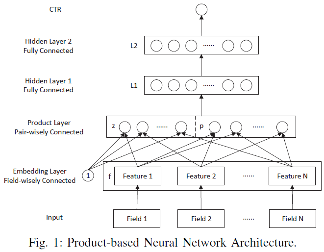

- **代码实现**

```python
class PNN(BaseModel):
    """Instantiates the Product-based Neural Network architecture.

    :param dnn_feature_columns: An iterable containing all the features used by deep part of the model.
    :param dnn_hidden_units: list,list of positive integer or empty list, the layer number and units in each layer of deep net
    :param l2_reg_embedding: float . L2 regularizer strength applied to embedding vector
    :param l2_reg_dnn: float. L2 regularizer strength applied to DNN
    :param init_std: float,to use as the initialize std of embedding vector
    :param seed: integer ,to use as random seed.
    :param dnn_dropout: float in [0,1), the probability we will drop out a given DNN coordinate.
    :param dnn_activation: Activation function to use in DNN
    :param use_inner: bool,whether use inner-product or not.
    :param use_outter: bool,whether use outter-product or not.
    :param kernel_type: str,kernel_type used in outter-product,can be ``'mat'`` , ``'vec'`` or ``'num'``
    :param task: str, ``"binary"`` for  binary logloss or  ``"regression"`` for regression loss
    :param device: str, ``"cpu"`` or ``"cuda:0"``
    :param gpus: list of int or torch.device for multiple gpus. If None, run on `device`. `gpus[0]` should be the same gpu with `device`.
    :return: A PyTorch model instance.

    """
    def __init__(self, dnn_feature_columns, dnn_hidden_units=(128, 128), l2_reg_embedding=1e-5, l2_reg_dnn=0,
                 init_std=0.0001, seed=1024, dnn_dropout=0, dnn_activation='relu', use_inner=True, use_outter=False,
                 kernel_type='mat', task='binary', device='cpu', gpus=None):

        super(PNN, self).__init__([], dnn_feature_columns, l2_reg_linear=0, l2_reg_embedding=l2_reg_embedding,
                                  init_std=init_std, seed=seed, task=task, device=device, gpus=gpus)

        if kernel_type not in ['mat', 'vec', 'num']:
            raise ValueError("kernel_type must be mat,vec or num")

        self.use_inner = use_inner
        self.use_outter = use_outter
        self.kernel_type = kernel_type
        self.task = task

        product_out_dim = 0
        num_inputs = self.compute_input_dim(dnn_feature_columns, include_dense=False, feature_group=True)
        num_pairs = int(num_inputs * (num_inputs - 1) / 2)

        if self.use_inner:
            product_out_dim += num_pairs
            self.innerproduct = InnerProductLayer(device=device)

        if self.use_outter:
            product_out_dim += num_pairs
            self.outterproduct = OutterProductLayer(
                num_inputs, self.embedding_size, kernel_type=kernel_type, device=device)

        self.dnn = DNN(product_out_dim + self.compute_input_dim(dnn_feature_columns), dnn_hidden_units,
                       activation=dnn_activation, l2_reg=l2_reg_dnn, dropout_rate=dnn_dropout, use_bn=False,
                       init_std=init_std, device=device)

        self.dnn_linear = nn.Linear(
            dnn_hidden_units[-1], 1, bias=False).to(device)
        self.add_regularization_weight(
            filter(lambda x: 'weight' in x[0] and 'bn' not in x[0], self.dnn.named_parameters()), l2=l2_reg_dnn)
        self.add_regularization_weight(self.dnn_linear.weight, l2=l2_reg_dnn)

        self.to(device)

    def forward(self, X):
        sparse_embedding_list, dense_value_list = self.input_from_feature_columns(X, self.dnn_feature_columns,
                                                                                  self.embedding_dict)
        linear_signal = torch.flatten(
            concat_fun(sparse_embedding_list), start_dim=1)

        if self.use_inner:
            inner_product = torch.flatten(
                self.innerproduct(sparse_embedding_list), start_dim=1)

        if self.use_outter:
            outer_product = self.outterproduct(sparse_embedding_list)

        if self.use_outter and self.use_inner:
            product_layer = torch.cat(
                [linear_signal, inner_product, outer_product], dim=1)
        elif self.use_outter:
            product_layer = torch.cat([linear_signal, outer_product], dim=1)
        elif self.use_inner:
            product_layer = torch.cat([linear_signal, inner_product], dim=1)
        else:
            product_layer = linear_signal

        dnn_input = combined_dnn_input([product_layer], dense_value_list)
        dnn_output = self.dnn(dnn_input)
        dnn_logit = self.dnn_linear(dnn_output)
        logit = dnn_logit

        y_pred = self.out(logit)
        return y_pred
```

## Wide & Deep 

Wide & Deep模型结合Wide线性模型的记忆性（Memorization）和Deep模型的泛化性（Generalization），比单纯的wide模型或者单纯的deep模型都效果更好。

- **Wide部分**
  - Wide部分就是一个线性模型$y=w^{\intercal}x+b$，其中，$x=[x_1,x_2,...,x_d]$是一组维度为$d$的特征，特征集合包含原始的输入特征，以及变换后的特征。最重要的特征变换之一是交叉乘积变换（`cross-product transformation`）。
    - $\phi_k(x)=\prod_{i=1}^d x_i^{c^{ki}}$, $c_{ki} \in {0, 1}$
    - 这类变换建模了二分特征之间的关系，同时也给线性模型增加了非线性。
- **Deep部分**
  - Deep部分是一个前馈神经网络（feed-forward neural network）。对于高维稀疏的类别特征（categorical features），它们会首先被转换成低维稠密的实值矩阵（real-valued vector），也就是embedding。通常，这类embedding的维度是$O(10)$到$O(100)$。embedding随机初始化以后，随着模型一起训练。然后，这低维稠密的embedding被送入隐层
    - $a^{(l+1)}=f(W^{(l)}a^{(l)}+b^{(l)})$
- **Wide & Deep联合训练**
  - Wide和deep部分的输出通过一个weighted sum来合并，然后送入一个logistic loss function。
  - 在实验时，对于wide部分，采用带有L1正则化的FTRL（Follow-the-regularized-leader）来作为优化器，对于deep部分，采用Adagrad作为优化器。
  - 对于logistic regression，模型的预测为：
    - $P(Y=1|x)=\sigma(w_{wide}^{\intercal}[x,\phi(x)]+w_{deep}^{\intercal}a^{(l_f)}+b)$
    - Y是二分类label，$\sigma(\cdot)$是sigmoid函数，$\phi(x)$是原始特征$x$的交叉乘积变换，$b$是bias，$w_{wide}$是wide模型的权重，$w_{deep}$是应用到最终的激活函数$a^{l_f}$的权重。
- **系统实现**
  - 流程可以分为三个阶段：数据生成（data generation），模型训练（model training）和模型服务（model serving）。
    - 数据生成（Data Generation）
    - 模型训练（Model Training）
      - 在deep部分，每个类别特征都用一个32维的embedding来表示，拼接所有的embeddings以后，会生成一个约1200维的embedding。然后，拼接的矩阵然后被送入3个ReLU层，最后是logistic输出层。
      - 在5000亿的样本上进行训练
      - 在把训练好的模型推上server之前，需要检查它不会出问题。
    - 模型服务（Model Serving）
      - 为了让每个request都能在10ms内完成，采用multithreading并行化，并行地跑小批量batches。
- **实验结果**
  - Wide&Deep模型相比于原始的wide-only模型提升了app下载率3.9%，相比于deep-only模型提升app下载率1%。
  - 通过多线程并行化和小批量预测，提升客户端延迟到14ms。

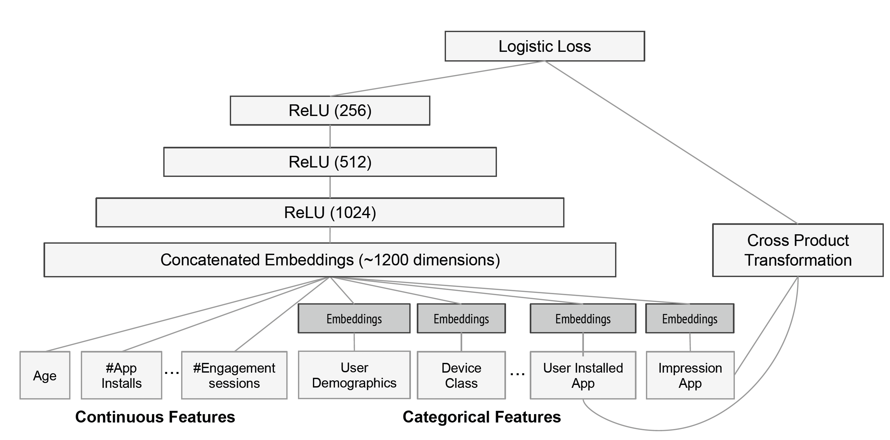

> **代码实现**

```python
class WDL(BaseModel):
    """Instantiates the Wide&Deep Learning architecture.

    :param linear_feature_columns: An iterable containing all the features used by linear part of the model.
    :param dnn_feature_columns: An iterable containing all the features used by deep part of the model.
    :param dnn_hidden_units: list,list of positive integer or empty list, the layer number and units in each layer of DNN
    :param l2_reg_linear: float. L2 regularizer strength applied to wide part
    :param l2_reg_embedding: float. L2 regularizer strength applied to embedding vector
    :param l2_reg_dnn: float. L2 regularizer strength applied to DNN
    :param init_std: float,to use as the initialize std of embedding vector
    :param seed: integer ,to use as random seed.
    :param dnn_dropout: float in [0,1), the probability we will drop out a given DNN coordinate.
    :param dnn_activation: Activation function to use in DNN
    :param task: str, ``"binary"`` for  binary logloss or  ``"regression"`` for regression loss
    :param device: str, ``"cpu"`` or ``"cuda:0"``
    :param gpus: list of int or torch.device for multiple gpus. If None, run on `device`. `gpus[0]` should be the same gpu with `device`.
    :return: A PyTorch model instance.

    """

    def __init__(self,
                 linear_feature_columns, dnn_feature_columns, dnn_hidden_units=(256, 128),
                 l2_reg_linear=1e-5,
                 l2_reg_embedding=1e-5, l2_reg_dnn=0, init_std=0.0001, seed=1024, dnn_dropout=0, dnn_activation='relu',
                 dnn_use_bn=False,
                 task='binary', device='cpu', gpus=None):

        super(WDL, self).__init__(linear_feature_columns, dnn_feature_columns, l2_reg_linear=l2_reg_linear,
                                  l2_reg_embedding=l2_reg_embedding, init_std=init_std, seed=seed, task=task,
                                  device=device, gpus=gpus)

        self.use_dnn = len(dnn_feature_columns) > 0 and len(dnn_hidden_units) > 0
        if self.use_dnn:
            self.dnn = DNN(self.compute_input_dim(dnn_feature_columns), dnn_hidden_units,
                           activation=dnn_activation, l2_reg=l2_reg_dnn, dropout_rate=dnn_dropout, use_bn=dnn_use_bn,
                           init_std=init_std, device=device)
            self.dnn_linear = nn.Linear(dnn_hidden_units[-1], 1, bias=False).to(device)
            self.add_regularization_weight(
                filter(lambda x: 'weight' in x[0] and 'bn' not in x[0], self.dnn.named_parameters()), l2=l2_reg_dnn)
            self.add_regularization_weight(self.dnn_linear.weight, l2=l2_reg_dnn)

        self.to(device)

    def forward(self, X):

        sparse_embedding_list, dense_value_list = self.input_from_feature_columns(X, self.dnn_feature_columns,
                                                                                  self.embedding_dict)
        logit = self.linear_model(X)

        if self.use_dnn:
            dnn_input = combined_dnn_input(sparse_embedding_list, dense_value_list)
            dnn_output = self.dnn(dnn_input)
            dnn_logit = self.dnn_linear(dnn_output)
            logit += dnn_logit
        
		y_pred = self.out(logit)
        return y_pred
```

## DeepFM

和Wide&Deep模型类似，DeepFM模型同样由浅层模型和深层模型联合训练得到。不同点主要有以下两点：

1. Wide模型部分由LR替换为FM。FM模型具有自动学习交叉特征的能力，避免了原始Wide&Deep模型中浅层部分人工特征工程的工作。
2. 共享原始输入特征。DeepFM模型的原始特征讲作为FM和Deep模型部分的共同输入，保证模型特征的准确与一致。 

- **特征**
  - 对于特征$i$，$w_i$标量表示一阶重要性（order-1 importance），一个隐矩阵$V_i$用来衡量与其他特征的相关性（高阶）
- **输出**
  - $\hat{y}=sigmoid(y_{FM}+y_{DNN})$
- **FM部分**
  - FM部分是一个factorization machine（因子分解机），用于学习特征之间的关系。
  - FM会通过内积的方式学到二阶关系
  - FM的输出是Addition Unit和Inner Product Unit的加和
    - $y_{FM}=\langle w,x\rangle+\sum_{i=1}^d\sum_{j=i+1}^d \langle V_i,V_j\rangle x_i\cdot x_j$
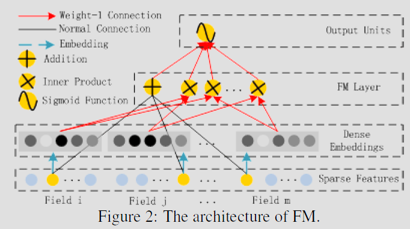
- **Deep部分**
  - Deep部分是一个前馈神经网络（feed-forward neural network），用来建模高阶的特征关系。
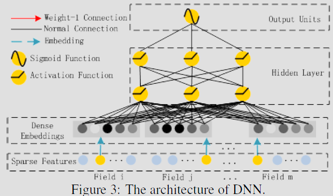
- **实验结果**
  - 评价度量（Evaluation Metrics）
    - AUC
    - Logloss (cross entropy)
  - Criteo Dataset
    - 45 million用户点击记录，13个连续特征，26个类别特征
  - Company Dataset
    - 7天用户点击记录用于训练，1天记录用于测试，一共是1 billion数据量
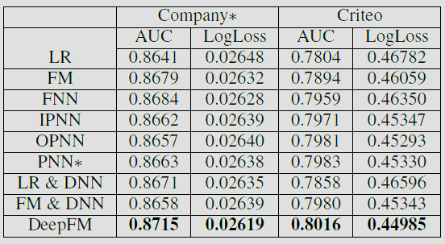
- **代码实现**

```python
class DeepFM(BaseModel):
    """Instantiates the DeepFM Network architecture.

    :param linear_feature_columns: An iterable containing all the features used by linear part of the model.
    :param dnn_feature_columns: An iterable containing all the features used by deep part of the model.
    :param use_fm: bool,use FM part or not
    :param dnn_hidden_units: list,list of positive integer or empty list, the layer number and units in each layer of DNN
    :param l2_reg_linear: float. L2 regularizer strength applied to linear part
    :param l2_reg_embedding: float. L2 regularizer strength applied to embedding vector
    :param l2_reg_dnn: float. L2 regularizer strength applied to DNN
    :param init_std: float,to use as the initialize std of embedding vector
    :param seed: integer ,to use as random seed.
    :param dnn_dropout: float in [0,1), the probability we will drop out a given DNN coordinate.
    :param dnn_activation: Activation function to use in DNN
    :param dnn_use_bn: bool. Whether use BatchNormalization before activation or not in DNN
    :param task: str, ``"binary"`` for  binary logloss or  ``"regression"`` for regression loss
    :param device: str, ``"cpu"`` or ``"cuda:0"``
    :param gpus: list of int or torch.device for multiple gpus. If None, run on `device`. `gpus[0]` should be the same gpu with `device`.
    :return: A PyTorch model instance.
    """
    def __init__(self,
                 linear_feature_columns, dnn_feature_columns, use_fm=True,
                 dnn_hidden_units=(256, 128),
                 l2_reg_linear=0.00001, l2_reg_embedding=0.00001, l2_reg_dnn=0, init_std=0.0001, seed=1024,
                 dnn_dropout=0,
                 dnn_activation='relu', dnn_use_bn=False, task='binary', device='cpu', gpus=None):

        super(DeepFM, self).__init__(linear_feature_columns, dnn_feature_columns, l2_reg_linear=l2_reg_linear,
                                     l2_reg_embedding=l2_reg_embedding, init_std=init_std, seed=seed, task=task,
                                     device=device, gpus=gpus)

        self.use_fm = use_fm
        self.use_dnn = len(dnn_feature_columns) > 0 and len(
            dnn_hidden_units) > 0
        if use_fm:
            self.fm = FM()

        if self.use_dnn:
            self.dnn = DNN(self.compute_input_dim(dnn_feature_columns), dnn_hidden_units,
                           activation=dnn_activation, l2_reg=l2_reg_dnn, dropout_rate=dnn_dropout, use_bn=dnn_use_bn,
                           init_std=init_std, device=device)
            self.dnn_linear = nn.Linear(
                dnn_hidden_units[-1], 1, bias=False).to(device)

            self.add_regularization_weight(
                filter(lambda x: 'weight' in x[0] and 'bn' not in x[0], self.dnn.named_parameters()), l2=l2_reg_dnn)
            self.add_regularization_weight(self.dnn_linear.weight, l2=l2_reg_dnn)
        self.to(device)

    def forward(self, X):
        sparse_embedding_list, dense_value_list = self.input_from_feature_columns(X, self.dnn_feature_columns,
                                                                                  self.embedding_dict)
        logit = self.linear_model(X)

        if self.use_fm and len(sparse_embedding_list) > 0:
            fm_input = torch.cat(sparse_embedding_list, dim=1)
            logit += self.fm(fm_input)

        if self.use_dnn:
            dnn_input = combined_dnn_input(
                sparse_embedding_list, dense_value_list)
            dnn_output = self.dnn(dnn_input)
            dnn_logit = self.dnn_linear(dnn_output)
            logit += dnn_logit

        y_pred = self.out(logit)
        return y_pred
```

## Deep & Cross Network (DCN)

针对大规模系数特征的点击率预估问题，Google在2016年提出Wide&Deep的结构来同时实现Memorization与Generalization，但是在Wide部分，仍然需要人工地设计特征叉乘，之后的DeepFM中的FM可以自动组合特征，但也仅限于二阶叉乘，Deep&Cross即是更进阶版的尝试，试图自动学习高阶的特征组合。

- **核心贡献点**
  - 提出了可以在每一层显式构建交叉特征的cross network，而且不需要人工特征工程和穷举搜索
  - Cross network是memory efficient，而且易于实现
- **Deep & Cross架构**
  - Embedding and Stacking Layer
    - 稀疏特征被映射到稠密特征：$x_{embed,i}=W_{embed,i} x_i$
    - 最终，和其他的normalized过后的稠密特征一起，组成一个特征：$x_0=[x_{embed,1}^{\intercal},...,x_{embed,k}^{\intercal},x_{dense}^{\intercal}]$
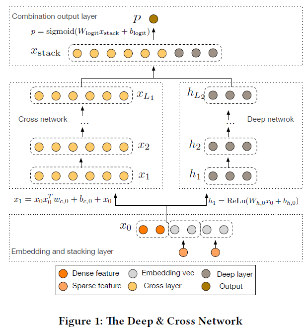
  - Cross Network & Deep Network
    - Cross Network
      - 由多层cross layer组成，每一层：$x_{l+1}=x_0x_l^{\intercal}w_L+b_l+x_l=f(x_l,w_l,b_l)+x_l$
      - 特征交叉维度取决于层的深度，$l$层的cross network最高阶维度是$l+1$，而整个cross network实际上包含了1到$l+1$的特征交叉维度
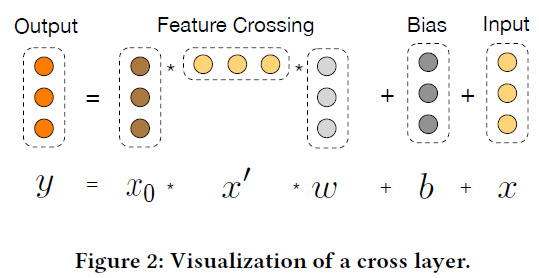
      - 复杂度：$d\times L_c \times 2$，其中$L_c$表示cross层的数量，$d$表示输入的维度，因此，cross network的时间和空间复杂度都与输入维度呈线性关系
    - Deep Network
      - 全连接前馈神经网络 Fully-connected feed-forward network
      - 每一层 $h_{l+1}=f(w_lh_l+b_l)$
      - 复杂度：$d\times m+m+(m^2+m)\times (L_d -1)$，其中，$L_d$是层的数量，$m$是层的size
  - Combination Layer
    - 合并层把deep层和cross层的输出拼接起来，送入一个标准的logits layer
    - $p=\sigma([x_{L_1}^{\intercal},h_{L_2}^{\intercal}]w_{logits})$，其中$\sigma(x)=1/(1+exp(-x))$
    - 损失函数是logloss
      - $loss=-\frac{1}{N}\sum_{i=1}^N y_ilog(p_i)+(1-y_i)log(1-p_i)+\lambda\sum_l \|w_l\|^2$
- **实验结果**
  - 实验数据：Criteo Display Ads，7天的11GB用户日志，前6天数据作为训练数据，第7天数据平均拆分为validation和test数据
  - 最佳参数
    - DCN：2个1024的deep层，6个cross层
    - DNN（DCN with no cross layer）：5个1024的deep层
    - DC（Deep Crossing）：输入424，cross537，5个residual units
    - LR：42个cross特征
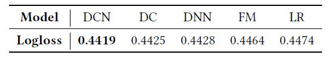

```python
class DCN(BaseModel):
    """Instantiates the Deep&Cross Network architecture. Including DCN-V (parameterization='vector')
    and DCN-M (parameterization='matrix').

    :param linear_feature_columns: An iterable containing all the features used by linear part of the model.
    :param dnn_feature_columns: An iterable containing all the features used by deep part of the model.
    :param cross_num: positive integet,cross layer number
    :param cross_parameterization: str, ``"vector"`` or ``"matrix"``, how to parameterize the cross network.
    :param dnn_hidden_units: list,list of positive integer or empty list, the layer number and units in each layer of DNN
    :param l2_reg_embedding: float. L2 regularizer strength applied to embedding vector
    :param l2_reg_cross: float. L2 regularizer strength applied to cross net
    :param l2_reg_dnn: float. L2 regularizer strength applied to DNN
    :param init_std: float,to use as the initialize std of embedding vector
    :param seed: integer ,to use as random seed.
    :param dnn_dropout: float in [0,1), the probability we will drop out a given DNN coordinate.
    :param dnn_use_bn: bool. Whether use BatchNormalization before activation or not DNN
    :param dnn_activation: Activation function to use in DNN
    :param task: str, ``"binary"`` for  binary logloss or  ``"regression"`` for regression loss
    :param device: str, ``"cpu"`` or ``"cuda:0"``
    :param gpus: list of int or torch.device for multiple gpus. If None, run on `device`. `gpus[0]` should be the same gpu with `device`.
    :return: A PyTorch model instance.

    """
    def __init__(self, linear_feature_columns, dnn_feature_columns, cross_num=2, cross_parameterization='vector',
                 dnn_hidden_units=(128, 128), l2_reg_linear=0.00001, l2_reg_embedding=0.00001, l2_reg_cross=0.00001,
                 l2_reg_dnn=0, init_std=0.0001, seed=1024, dnn_dropout=0, dnn_activation='relu', dnn_use_bn=False,
                 task='binary', device='cpu', gpus=None):

        super(DCN, self).__init__(linear_feature_columns=linear_feature_columns,
                                  dnn_feature_columns=dnn_feature_columns, l2_reg_embedding=l2_reg_embedding,
                                  init_std=init_std, seed=seed, task=task, device=device, gpus=gpus)
        self.dnn_hidden_units = dnn_hidden_units
        self.cross_num = cross_num
        self.dnn = DNN(self.compute_input_dim(dnn_feature_columns), dnn_hidden_units,
                       activation=dnn_activation, use_bn=dnn_use_bn, l2_reg=l2_reg_dnn, dropout_rate=dnn_dropout,
                       init_std=init_std, device=device)
        if len(self.dnn_hidden_units) > 0 and self.cross_num > 0:
            dnn_linear_in_feature = self.compute_input_dim(dnn_feature_columns) + dnn_hidden_units[-1]
        elif len(self.dnn_hidden_units) > 0:
            dnn_linear_in_feature = dnn_hidden_units[-1]
        elif self.cross_num > 0:
            dnn_linear_in_feature = self.compute_input_dim(dnn_feature_columns)

        self.dnn_linear = nn.Linear(dnn_linear_in_feature, 1, bias=False).to(
            device)
        self.crossnet = CrossNet(in_features=self.compute_input_dim(dnn_feature_columns),
                                 layer_num=cross_num, parameterization=cross_parameterization, device=device)
        self.add_regularization_weight(
            filter(lambda x: 'weight' in x[0] and 'bn' not in x[0], self.dnn.named_parameters()), l2=l2_reg_dnn)
        self.add_regularization_weight(self.dnn_linear.weight, l2=l2_reg_linear)
        self.add_regularization_weight(self.crossnet.kernels, l2=l2_reg_cross)
        self.to(device)

    def forward(self, X):
        logit = self.linear_model(X)
        sparse_embedding_list, dense_value_list = self.input_from_feature_columns(X, self.dnn_feature_columns,
                                                                                  self.embedding_dict)

        dnn_input = combined_dnn_input(sparse_embedding_list, dense_value_list)

        if len(self.dnn_hidden_units) > 0 and self.cross_num > 0:  # Deep & Cross
            deep_out = self.dnn(dnn_input)
            cross_out = self.crossnet(dnn_input)
            stack_out = torch.cat((cross_out, deep_out), dim=-1)
            logit += self.dnn_linear(stack_out)
        elif len(self.dnn_hidden_units) > 0:  # Only Deep
            deep_out = self.dnn(dnn_input)
            logit += self.dnn_linear(deep_out)
        elif self.cross_num > 0:  # Only Cross
            cross_out = self.crossnet(dnn_input)
            logit += self.dnn_linear(cross_out)
        else:  # Error
            pass
        y_pred = self.out(logit)
        return y_pred
```

## xDeepFM

- **主要贡献点**
  - DCN的升级版，把DCN中的cross network替换为Compressed Interaction Network (CIN)
  - 联合学习显式和隐式的高阶特征组合，无需人工特征工程
  - 压缩交互网络（CIN， Compressed Interaction Network）用来显式学习高阶特征组合
- **模型**
  - **Compressed Interaction Network（CIN）**
    - 优点
      - 交互是在vector-wise level，而不是在bit-wise level
      - 高阶特征组合显式
      - 网络复杂度不会随着组合维度而指数上升
    - CIN层的输入来自于Embedding层，假设有$m$个field，每个field的embedding vector维度为$D$，则输入可表示为矩阵$X^0 \in \mathbb{R}^{m*D}$
    - CIN计算：
      - 取前一层$X^{k-1}\in \mathbb{R}^{H_{k-1}*D}$中的$H_{k-1}$个vector，与输入层$X^0\in \mathbb{R}^{m*D}$中的$m$个vector，进行两两Hadamard乘积运算，得到$H_{k-1}*m$个vector，然后加权求和
      - 第$k$层的不同vector区别在于，对这$H_{k-1}*m$个vector求和的权重矩阵不同。$H_k$即对应有多少个不同的权重矩阵$W^k$，是一个可以调整的超参
    - CIN与Cross的差异：
      - Cross是bit-wise的，而CIN是vector-wise的
      - 在第$l$层，Cross包含从1阶到第$l+1$阶的所有组合特征，而CIN只包含$l+1$阶的组合特征。相应地，Cross在输出层输出全部结果，而CIN在每层都输出中间结果。
    - 复杂度
      - 假设CIN和DNN每层神经元/向量个数都为$H$，网络深度为$T$。那么CIN的参数空间复杂度为$O(mTH^2)$，普通的DNN为O(mDH+TH^2)，CIN的空间复杂度与输入维度$D$无关，此外，如果有必要，CIN还可以对权重矩阵$W$进行$L$阶矩阵分解从而能降低空间复杂度
      - CIN的时间复杂度就不容乐观了，按照上面介绍的计算方式为$O(mH^2DT)$，而DNN为$O(mDH+TH^2)$，时间复杂度会是CIN的一个主要痛点。
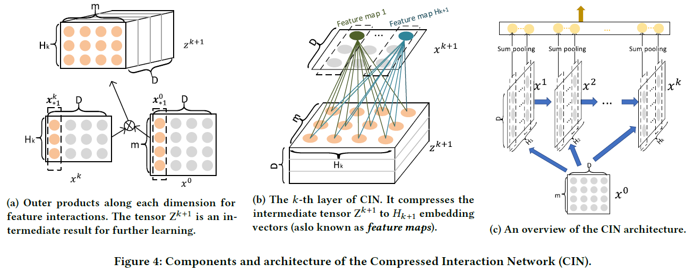
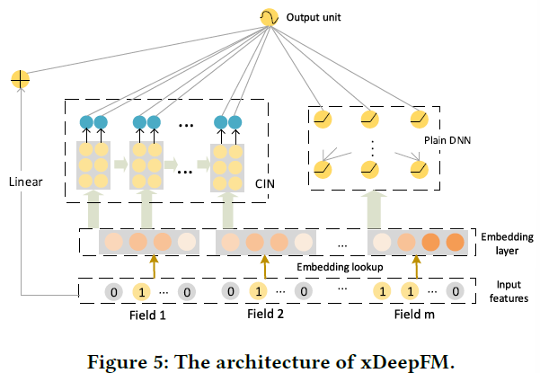
- **实验结果**
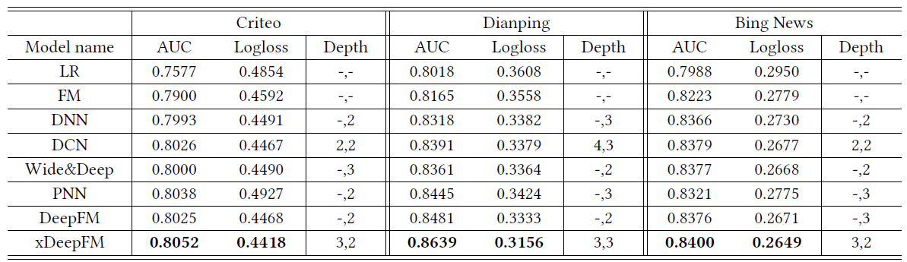
-**代码实现**

```python
class xDeepFM(BaseModel):
    """Instantiates the xDeepFM architecture.

    :param linear_feature_columns: An iterable containing all the features used by linear part of the model.
    :param dnn_feature_columns: An iterable containing all the features used by deep part of the model.
    :param dnn_hidden_units: list,list of positive integer or empty list, the layer number and units in each layer of deep net
    :param cin_layer_size: list,list of positive integer or empty list, the feature maps  in each hidden layer of Compressed Interaction Network
    :param cin_split_half: bool.if set to True, half of the feature maps in each hidden will connect to output unit
    :param cin_activation: activation function used on feature maps
    :param l2_reg_linear: float. L2 regularizer strength applied to linear part
    :param l2_reg_embedding: L2 regularizer strength applied to embedding vector
    :param l2_reg_dnn: L2 regularizer strength applied to deep net
    :param l2_reg_cin: L2 regularizer strength applied to CIN.
    :param init_std: float,to use as the initialize std of embedding vector
    :param seed: integer ,to use as random seed.
    :param dnn_dropout: float in [0,1), the probability we will drop out a given DNN coordinate.
    :param dnn_activation: Activation function to use in DNN
    :param dnn_use_bn: bool. Whether use BatchNormalization before activation or not in DNN
    :param task: str, ``"binary"`` for  binary logloss or  ``"regression"`` for regression loss
    :param device: str, ``"cpu"`` or ``"cuda:0"``
    :param gpus: list of int or torch.device for multiple gpus. If None, run on `device`. `gpus[0]` should be the same gpu with `device`.
    :return: A PyTorch model instance.

    """
    def __init__(self, linear_feature_columns, dnn_feature_columns, dnn_hidden_units=(256, 256),
                 cin_layer_size=(256, 128,), cin_split_half=True, cin_activation='relu', l2_reg_linear=0.00001,
                 l2_reg_embedding=0.00001, l2_reg_dnn=0, l2_reg_cin=0, init_std=0.0001, seed=1024, dnn_dropout=0,
                 dnn_activation='relu', dnn_use_bn=False, task='binary', device='cpu', gpus=None):

        super(xDeepFM, self).__init__(linear_feature_columns, dnn_feature_columns, l2_reg_linear=l2_reg_linear,
                                      l2_reg_embedding=l2_reg_embedding, init_std=init_std, seed=seed, task=task,
                                      device=device, gpus=gpus)
        self.dnn_hidden_units = dnn_hidden_units
        self.use_dnn = len(dnn_feature_columns) > 0 and len(dnn_hidden_units) > 0
        if self.use_dnn:
            self.dnn = DNN(self.compute_input_dim(dnn_feature_columns), dnn_hidden_units,
                           activation=dnn_activation, l2_reg=l2_reg_dnn, dropout_rate=dnn_dropout, use_bn=dnn_use_bn,
                           init_std=init_std, device=device)
            self.dnn_linear = nn.Linear(dnn_hidden_units[-1], 1, bias=False).to(device)
            self.add_regularization_weight(
                filter(lambda x: 'weight' in x[0] and 'bn' not in x[0], self.dnn.named_parameters()), l2=l2_reg_dnn)

            self.add_regularization_weight(self.dnn_linear.weight, l2=l2_reg_dnn)

        self.cin_layer_size = cin_layer_size
        self.use_cin = len(self.cin_layer_size) > 0 and len(dnn_feature_columns) > 0
        if self.use_cin:
            field_num = len(self.embedding_dict)
            if cin_split_half == True:
                self.featuremap_num = sum(
                    cin_layer_size[:-1]) // 2 + cin_layer_size[-1]
            else:
                self.featuremap_num = sum(cin_layer_size)
            self.cin = CIN(field_num, cin_layer_size,
                           cin_activation, cin_split_half, l2_reg_cin, seed, device=device)
            self.cin_linear = nn.Linear(self.featuremap_num, 1, bias=False).to(device)
            self.add_regularization_weight(filter(lambda x: 'weight' in x[0], self.cin.named_parameters()),
                                           l2=l2_reg_cin)

        self.to(device)

    def forward(self, X):
        sparse_embedding_list, dense_value_list = self.input_from_feature_columns(X, self.dnn_feature_columns,
                                                                                  self.embedding_dict)

        linear_logit = self.linear_model(X)
        if self.use_cin:
            cin_input = torch.cat(sparse_embedding_list, dim=1)
            cin_output = self.cin(cin_input)
            cin_logit = self.cin_linear(cin_output)
        if self.use_dnn:
            dnn_input = combined_dnn_input(sparse_embedding_list, dense_value_list)
            dnn_output = self.dnn(dnn_input)
            dnn_logit = self.dnn_linear(dnn_output)

        if len(self.dnn_hidden_units) == 0 and len(self.cin_layer_size) == 0:  # only linear
            final_logit = linear_logit
        elif len(self.dnn_hidden_units) == 0 and len(self.cin_layer_size) > 0:  # linear + CIN
            final_logit = linear_logit + cin_logit
        elif len(self.dnn_hidden_units) > 0 and len(self.cin_layer_size) == 0:  # linear +　Deep
            final_logit = linear_logit + dnn_logit
        elif len(self.dnn_hidden_units) > 0 and len(self.cin_layer_size) > 0:  # linear + CIN + Deep
            final_logit = linear_logit + dnn_logit + cin_logit
        else:
            raise NotImplementedError

        y_pred = self.out(final_logit)
        return y_pred
```


## Deep Interest Network

- **主要贡献点**
  - `Local Activation Unit`: 设计了一个local activation unit来学习用户兴趣的表征，对于不同的商品来说，这个用户表征是不一样的。
  - `Mini-batch aware regularization`：在batch中只有非零特征参与L2 norm的计算（稀疏特征仅更新部分参数）
  - `Data Adaptive Activation Function`：激活函数自适应
- **背景**
  - 在电商场景下，CTR预估面临的问题是，用户的兴趣多种多样，存在于浏览、点击、加购物车、购买等等各类行为中，我们怎么样根据繁多的用户行为序列去预估当前的点击概率。[深度兴趣网络DIN](../papers/deep_interest_network.pdf)引入注意力（attention）机制，在预测时，对用户不同行为的注意力不一样。
  - 在此之前，通常会一碗水端平地考虑所有行为的影响，对应到模型中，就是我们会用一个average pooling层把用户交互过的所有商品的embedding平均一下形成这个用户的user vector。顶多，考虑用户行为历史的发生时间，引入time decay，让最近的行为产生的影响大一下，也就是在做average pooling的时候按时间调整一下权重。
  - 但是，在不同的时刻，不同的场景下，用户当下的关注点不总是和所有的用户历史行为相关，比如情人节快到了，用户可能就突然开始对巧克力、鲜花等商品感兴趣。**注意力机制，就是模型在预测的时候，对用户不同行为的注意力是不一样的**。
- **特征**
  - 没有组合特征，通过DNN建模特征交互信息

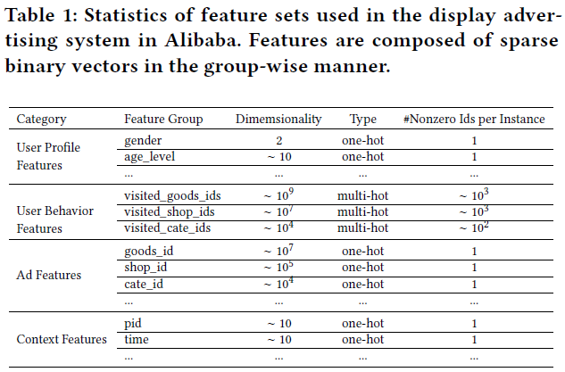
- **模型**
  - 基础模型（Base Model）—— Embedding & MLP
    - Embedding layer
      - 将高维稀疏特征转换为低维稠密embedding
    - Pooling layer and Concat layer
      - 不同用户有不同数量的用户行为，所以需要通过pooling layer来将不等长的embedding转换到定长的embedding。一般使用sum pooling或者average pooling
    - MLP
      - 拿到concat的embedding以后，MLP进行学习
    - Loss
      - negative log-likelihood $L=-\frac{1}{N}\sum_{(x,y)\in S}(ylogp(x)+(1-y)log(1-p(x)))$
  - **DIN模型**
    - Base模型的问题
      - 即使面对不同的广告，用户行为pooling之后的embedding也固定不变
    - DIN的解决方案
      - `Local Activation Unit`: 模拟用户看到当前广告的心理状态，对用户的历史行为做一个软搜索（soft search），与当前广告有关的历史行为才会对click action做出贡献。因此，不同的广告对应的用户行为embedding是不同的
        - $V_u=f(V_a)=\sum_{i=1}^N w_i V_i=\sum_{i=1}^N g(V_i,V_a) V_i$
        - 上式中，$V_u$是用户的embedding向量，$V_a$是候选商品的embedding向量，$V_i$是用户$u$的第$i$次行为的embedding向量，比如用户浏览商品或店铺的embedding向量。因为加入了注意力机制，$V_u$从$V_i$的加和变成了$V_i$的加权和，$V_i$的权重$w_i$就由$V_i$与$V_a$的关系决定，也就是上式中的$g(V_i,V_a)$。
        - 与attention机制有点相似
        - 尝试过LSTM来序列建模用户行为，但是没有改进效果
    - 训练技巧
      - Mini-batch Aware Regularization
      - Data Adaptive Activation Function

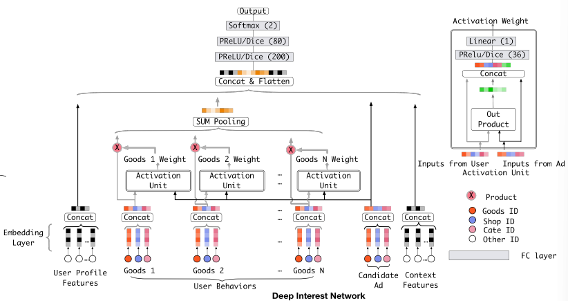
- **实验结果**
  - AUC $=\frac{\sum_{i=1}^n \#impression_i\times AUC_i}{\sum_{i=1}^n \#impression_i}$
  - RelaImpr $=(\frac{AUC(measured model) - 0.5}{AUC(base model) - 0.5} - 1) \times 100\%$

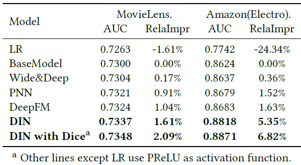
- **缺点**
  - 关注短期兴趣，忽略长期兴趣

- **代码实现**

```python
class DIN(BaseModel):
    """Instantiates the Deep Interest Network architecture.

    :param dnn_feature_columns: An iterable containing all the features used by deep part of the model.
    :param history_feature_list: list,to indicate  sequence sparse field
    :param dnn_use_bn: bool. Whether use BatchNormalization before activation or not in deep net
    :param dnn_hidden_units: list,list of positive integer or empty list, the layer number and units in each layer of deep net
    :param dnn_activation: Activation function to use in deep net
    :param att_hidden_size: list,list of positive integer , the layer number and units in each layer of attention net
    :param att_activation: Activation function to use in attention net
    :param att_weight_normalization: bool. Whether normalize the attention score of local activation unit.
    :param l2_reg_dnn: float. L2 regularizer strength applied to DNN
    :param l2_reg_embedding: float. L2 regularizer strength applied to embedding vector
    :param dnn_dropout: float in [0,1), the probability we will drop out a given DNN coordinate.
    :param init_std: float,to use as the initialize std of embedding vector
    :param seed: integer ,to use as random seed.
    :param task: str, ``"binary"`` for  binary logloss or  ``"regression"`` for regression loss
    :param device: str, ``"cpu"`` or ``"cuda:0"``
    :param gpus: list of int or torch.device for multiple gpus. If None, run on `device`. `gpus[0]` should be the same gpu with `device`.
    :return:  A PyTorch model instance.

    """
    def __init__(self, dnn_feature_columns, history_feature_list, dnn_use_bn=False,
                 dnn_hidden_units=(256, 128), dnn_activation='relu', att_hidden_size=(64, 16),
                 att_activation='Dice', att_weight_normalization=False, l2_reg_dnn=0.0,
                 l2_reg_embedding=1e-6, dnn_dropout=0, init_std=0.0001,
                 seed=1024, task='binary', device='cpu', gpus=None):
        super(DIN, self).__init__([], dnn_feature_columns, l2_reg_linear=0, l2_reg_embedding=l2_reg_embedding,
                                  init_std=init_std, seed=seed, task=task, device=device, gpus=gpus)

        self.sparse_feature_columns = list(
            filter(lambda x: isinstance(x, SparseFeat), dnn_feature_columns)) if dnn_feature_columns else []
        self.varlen_sparse_feature_columns = list(
            filter(lambda x: isinstance(x, VarLenSparseFeat), dnn_feature_columns)) if dnn_feature_columns else []

        self.history_feature_list = history_feature_list

        self.history_feature_columns = []
        self.sparse_varlen_feature_columns = []
        self.history_fc_names = list(map(lambda x: "hist_" + x, history_feature_list))

        for fc in self.varlen_sparse_feature_columns:
            feature_name = fc.name
            if feature_name in self.history_fc_names:
                self.history_feature_columns.append(fc)
            else:
                self.sparse_varlen_feature_columns.append(fc)

        att_emb_dim = self._compute_interest_dim()

        self.attention = AttentionSequencePoolingLayer(att_hidden_units=att_hidden_size,
                                                       embedding_dim=att_emb_dim,
                                                       att_activation=att_activation,
                                                       return_score=False,
                                                       supports_masking=False,
                                                       weight_normalization=att_weight_normalization)

        self.dnn = DNN(inputs_dim=self.compute_input_dim(dnn_feature_columns),
                       hidden_units=dnn_hidden_units,
                       activation=dnn_activation,
                       dropout_rate=dnn_dropout,
                       l2_reg=l2_reg_dnn,
                       use_bn=dnn_use_bn)
        self.dnn_linear = nn.Linear(dnn_hidden_units[-1], 1, bias=False).to(device)
        self.to(device)


    def forward(self, X):
        _, dense_value_list = self.input_from_feature_columns(X, self.dnn_feature_columns, self.embedding_dict)

        # sequence pooling part
        query_emb_list = embedding_lookup(X, self.embedding_dict, self.feature_index, self.sparse_feature_columns,
                                          return_feat_list=self.history_feature_list, to_list=True)
        keys_emb_list = embedding_lookup(X, self.embedding_dict, self.feature_index, self.history_feature_columns,
                                         return_feat_list=self.history_fc_names, to_list=True)
        dnn_input_emb_list = embedding_lookup(X, self.embedding_dict, self.feature_index, self.sparse_feature_columns,
                                              to_list=True)
        sequence_embed_dict = varlen_embedding_lookup(X, self.embedding_dict, self.feature_index,
                                                      self.sparse_varlen_feature_columns)
        sequence_embed_list = get_varlen_pooling_list(sequence_embed_dict, X, self.feature_index,
                                                      self.sparse_varlen_feature_columns, self.device)
        dnn_input_emb_list += sequence_embed_list
        deep_input_emb = torch.cat(dnn_input_emb_list, dim=-1)

        # concatenate
        query_emb = torch.cat(query_emb_list, dim=-1)                     # [B, 1, E]
        keys_emb = torch.cat(keys_emb_list, dim=-1)                       # [B, T, E]

        keys_length_feature_name = [feat.length_name for feat in self.varlen_sparse_feature_columns if
                                    feat.length_name is not None]
        keys_length = torch.squeeze(maxlen_lookup(X, self.feature_index, keys_length_feature_name), 1)  # [B, 1]

        hist = self.attention(query_emb, keys_emb, keys_length)           # [B, 1, E]

        # deep part
        deep_input_emb = torch.cat((deep_input_emb, hist), dim=-1)
        deep_input_emb = deep_input_emb.view(deep_input_emb.size(0), -1)

        dnn_input = combined_dnn_input([deep_input_emb], dense_value_list)
        dnn_output = self.dnn(dnn_input)
        dnn_logit = self.dnn_linear(dnn_output)

        y_pred = self.out(dnn_logit)
        return y_pred

    def _compute_interest_dim(self):
        interest_dim = 0
        for feat in self.sparse_feature_columns:
            if feat.name in self.history_feature_list:
                interest_dim += feat.embedding_dim
        return interest_dim
```

## DCN V2

- **主要贡献点**
- 

# 工程问题

## 线上serving


# 评价指标

[Predictive Model Performance: Offline and Online Evaluations](https://chbrown.github.io/kdd-2013-usb/kdd/p1294.pdf)

**如何评价CTR预估效果？**

难度：

- 观察到的是点击或没点击的二元数据，但是要预估的是一个[0, 1]上的点击概率，换句话说就是没有绝对的ground truth；
- 各种机器学习模型训练完以后出来的分数，即使是LR，也不见得就是一个好的可以直接拿来当预估结果的概率；
- 观察数据往往是有偏的，观察到的广告展现和点击数据都是赢得竞价的那些。

常用评价指标是logloss和AUC。logloss更关注和观察数据的吻合速度，AUC更关注rank order，这两个指标适合线下评估。线上有更简单直接的评价方式：把线上的impression log按照预测的CTR从小到大排序，然后按照某个特点流量步长（比如每10000个impression）分桶，统计每个分桶的平均预估CTR（pCTR）和实际CTR（aCTR），把他俩的对比关系画出来，理想状态下应该是一条斜率为1的线。

线上的其他业务指标，比如点击率、营收、利润、eCPC等是不能给出CTR预估效果评价的。这些业务指标，受到整个广告系统其他模块，如bid optimization, budget pacing等其他外部竞价环境的综合影响。

CTR预估，需要解决三个问题：
- rank order；
- calibration；
- sample distribution reconstruction;

## COPC

全称click over predicted click，copc=实际的点击率/模型预测的点击率，主要衡量整体预估的偏高和偏低，越接近1越好，一般情况下在1附近波动。


## AUC

- 最好不要把所有流量合起来用AUC评估，因为无法区分广告点击率在哪些流量上预测得好或不好。
- 当AUC指标不好时，可以通过计算max AUC来验证是否是数据的问题，计算的方式是计算每一种特征组合的点击率，将这个点击率作为预测值计算AUC，计算出来的值是max AUC。
- 加入特征后（特征是user/context特征后），AUC的提升，上线后不一定会提升，因为离线评估计算的AUC是针对query与query之间的，而在线时，排序是针对ad与ad之间的。

## Logloss

对数损失（Log loss）亦被称为逻辑回归损失（Logistic regression loss）或交叉熵损失（Cross-entropy loss）。通常把模型关于单个样本预测值与真实值的差称为损失，损失越小，模型越好，而用于计算损失的函数称为损失函数。主要是评估距，但logloss在pCTR和CTR值比较近的时候（比如差个5%），区别比较小。

- Logloss对把正例预测的值很低，或是将负例的值预测得很高都会比较高的值，而将负例预测撑0.01，或者0.011，则区别不大。


## GAUC


# 其他

## 点击率预估 (CTR)

在计算广告系统中，一个可以携带广告请求的用户流量到达后台时，系统需要在较短时间（一般要求不超过 100ms）内返回一个或多个排序好的广告列表；在广告系统中，一般最后一步的排序 *score = bid * pctr <sup>alpha</sup>*；其中 *alpha* 参数控制排序倾向，如果*alpha*<1，则倾向于*pctr*，否则倾向于*bid*；这里的核心因子*pctr*就是通常所说的点击率（predicted click through rate）.

点击率预估是计算广告中非常重要的模块，预估一个用户对广告的点击概率，从而提升广告效果。

### 特征表示 Feature Representation

高维、稀疏、多field是输入给CTR预估模型的特征数据的典型特点。

#### Embedding表示

Embedding表示也叫做Distributed representation，起源于神经网络语言模型（NNLM）对语料库中的word的一种表示方法。相对于高维稀疏的one-hot编码表示，embedding-based的方法，学习一个低维稠密实数向量（low-dimensional dense embedding）。类似于hash方法，embedding方法把位数较多的稀疏数据压缩到位数较少的空间，不可避免会有冲突；然而，embedding学到的是类似主题的语义表示，对于item的“冲突”是希望发生的，这有点像软聚类，这样才能解决稀疏性的问题。

Google公司开源的word2vec工具让embedding表示方法广为人知。Embedding表示通常用神经网络模型来学习，当然也有其他学习方法，比如矩阵分解（MF）、因子分解机（FM)等。


### FM(Factorization Machine)因子分解机、FFM(Field-aware Factorizatiion Machine)

因子分解机(Factorization Machines, FM)通过特征对之间的隐变量内积来提取特征组合，其函数形式如下：


FM和基于树的模型（e.g. GBDT）都能够自动学习特征交叉组合。基于树的模型适合连续中低度稀疏数据，容易学到高阶组合。但是树模型却不适合学习高度稀疏数据的特征组合，一方面高度稀疏数据的特征维度一般很高，这时基于树的模型学习效率很低，甚至不可行；另一方面树模型也不能学习到训练数据中很少或没有出现的特征组合。相反，FM模型因为通过隐向量的内积来提取特征组合，对于训练数据中很少或没有出现的特征组合也能够学习到。例如，特征 *i* 和特征 *j* 在训练数据中从来没有成对出现过，但特征 *i* 经常和特征 *p* 成对出现，特征* *j* 也经常和特征 *p* 成对出现，因而在FM模型中特征 *i* 和特征 *j* 也会有一定的相关性。

在推荐系统中，常用矩阵分解（MF）的方法把User-Item评分矩阵分解为两个低秩矩阵的乘积，这两个低秩矩阵分别为User和Item的隐向量集合。通过User和Item隐向量的点积来预测用户对未见过的物品的兴趣。矩阵分解也是生成embedding表示的一种方法，示例图如下：


MF方法可以看作是FM模型的一种特例，即MF可以看作特征只有userId和itemId的FM模型。FM的优势是能够将更多的特征融入到这个框架中，并且可以同时使用一阶和二阶特征；而MF只能使用两个实体的二阶特征。


在二分类问题中，采用LogLoss损失函数时，FM模型可以看做是LR模型和MF方法的融合，如下图所示：


FFM（Field-aware Factorization Machine）模型是对FM模型的扩展，通过引入field的概念，FFM把相同性质的特征归于同一个field。例如，“Day=26/11/15”、 “Day=1/7/14”、 “Day=19/2/15”这三个特征都是代表日期的，可以放到同一个field中。在FFM中，每一维特征 *x<sub>i</sub>* ，针对其它特征的每一种field *f<sub>j</sub>* ，都会学习一个隐向量 *v<sub>i</sub>f<sub>j</sub>* 。因此，隐向量不仅与特征相关，也与field相关。假设样本的*n*个特征属于*f*个field，那么FFM的二次项有*nf*个隐向量。


FM可以看作FFM的特例，在FM模型中，每一维特征的隐向量只有一个，即FM是把所有特征都归属到一个field时的FFM模型。


### 混合逻辑回归（MLR）

MLR算法是alibaba在2012年提出并使用的广告点击率预估模型，2017年发表出来。MLR模型是对线性LR模型的推广，它利用分片线性方式对数据进行拟合。基本思路是采用分而治之的策略：如果分类空间本身是非线性的，则按照合适的方式把空间分为多个区域，每个区域里面可以用线性的方式进行拟合，最后MLR的输出就变为了多个子区域预测值的加权平均。如下图(C)所示，就是使用4个分片的MLR模型学到的结果。


上式即为MLR的目标函数，其中 m 为分片数（当 m=1 时，MLR退化为LR模型）； 是聚类参数，决定分片空间的划分，即某个样本属于某个特定分片的概率； 是分类参数，决定分片空间内的预测； 和  都是待学习的参数。最终模型的预测值为所有分片对应的子模型的预测值的期望。

MLR模型在大规模稀疏数据上探索和实现了非线性拟合能力，在分片数足够多时，有较强的非线性能力；同时模型复杂度可控，有较好泛化能力；同时保留了LR模型的自动特征选择能力。

MLR模型的思路非常简单，难点和挑战在于MLR模型的目标函数是非凸非光滑的，使得传统的梯度下降算法并不适用。相关的细节内容查询论文：Gai et al, “Learning Piece-wise Linear Models from Large Scale Data for Ad Click Prediction”。

另一方面，MLR模型可以看作带有一个隐层的神经网络。如下图， *x*是大规模的稀疏输入数据，MLR模型第一步是做了一个Embedding操作，分为两个部分，一种叫聚类Embedding（绿色），另一种是分类Embedding（红色）。两个投影都投到低维的空间，维度为*m* ，是MLR模型中的分片数。完成投影之后，通过很简单的内积（Inner Product）操作便可以进行预测，得到输出 *y* 。


### Wide & Deep Learning (WDL)

像LR这样的wide模型学习特征与目标之间的直接相关关系，偏重记忆（memorization），如在推荐系统中，wide模型产生的推荐是与用户历史行为的物品直接相关的物品。这样的模型缺乏刻画特征之间的关系的能力，比如模型无法感知到“土豆”和“马铃薯”是相同的实体，在训练样本中没有出现的特征组合自然就无法使用，因此可能模型学习到某种类型的用户喜欢“土豆”，但却会判定该类型的用户不喜欢“马铃薯”。

WDL是Google在2016年的paper中提出的模型，其巧妙地将传统的特征工程与深度模型进行了强强联合。模型结构如下:


WDL分为wide和deep两部分联合训练，单看wide部分与LR模型并没有什么区别；deep部分则是先对不同的ID类型特征做embedding，在embedding层接一个全连接的MLP（多层感知机），用于学习特征之间的高阶交叉组合关系。由于Embedding机制的引入，WDL相对于单纯的wide模型有更强的泛化能力。

### FNN (Factorization-machine supported Neural Network)

除了神经网络模型，FM模型也可以用来学习到特征的隐向量（embedding表示），因此一个自然的想法就是先用FM模型学习到特征的embedding表示，再用学到的embedding向量代替原始特征作为最终模型的特征。这个思路类似于LR+GBDT，整个学习过程分为两个阶段：第一个阶段先用一个模型做特征工程；第二个阶段用第一个阶段学习到新特征训练最终的模型。

FNN模型就是用FM模型学习到的embedding向量初始化MLP，再由MLP完成最终学习，其模型结构如下：


### PNN (Product-based Neural Networks)

MLP中的节点add操作可能不能有效探索到不同类别数据之间的交互关系，虽然MLP理论上可以以任意精度逼近任意函数，但越泛化的表达，拟合到具体数据的特定模式越不容易。PNN主要是在深度学习网络中增加了一个inner/outer product layer，用来建模特征之间的关系。


Embedding Layer和Product Layer之间的权重为常量1，在学习过程中不更新。Product Layer的节点分为两部分，一部分是*z*向量，另一部分是*p*向量。 *z*向量的维数与输入层的Field个数（ *N* ）相同， 。 *p*向量的每个元素的值由embedding层的feature向量两两成对并经过Product操作之后生成， ，因此*p*向量的维度为。这里的*f<sub>i</sub>*是field *i* 的embedding向量， ，其中*x*是输入向量，是field *i* 的one-hot编码向量。

这里所说的Product操作有两种：内积和外积；对应的网络结构分别为IPNN和OPNN，两者的区别如下图。


在IPNN中，由于Product Layer的 p 向量由field两两配对产生，因此维度膨胀很大，给 l_1 Layer的节点计算带来了很大的压力。受FM启发，可以把这个大矩阵转换分解为小矩阵和它的转置相乘，表征到低维度连续向量空间，来减少模型复杂度： 


在OPNN中，外积操作带来更多的网络参数，为减少计算量，使得模型更易于学习，采用了多个外积矩阵按元素叠加（element-wise superposition）的技巧来减少复杂度，具体如下： 


### DeepFM

深度神经网络对于学习复杂的特征关系非常有潜力。目前也有很多基于CNN与RNN的用于CTR预估的模型。但是基于CNN的模型比较偏向于相邻的特征组合关系提取，基于RNN的模型更适合有序列依赖的点击数据。

FNN模型首先预训练FM，再将训练好的FM应用到DNN中。PNN网络的embedding层与全连接层之间加了一层Product Layer来完成特征组合。PNN和FNN与其他已有的深度学习模型类似，都很难有效地提取出低阶特征组合。WDL模型混合了宽度模型与深度模型，但是宽度模型的输入依旧依赖于特征工程。上述模型要不然偏向于低阶特征或者高阶特征的提取，要不然依赖于特征工程。而DeepFM模型可以以端对端的方式来学习不同阶的组合特征关系，并且不需要其他特征工程。

DeepFM的结构中包含了因子分解机部分以及深度神经网络部分，分别负责低阶特征的提取和高阶特征的提取。其结构如下：


上图中红色箭头所表示的链接权重恒定为1（weight-1 connection），在训练过程中不更新，可以认为是把节点的值直接拷贝到后一层，再参与后一层节点的运算操作。

与Wide&Deep Model不同，DeepFM共享相同的输入与embedding向量。在Wide&Deep Model中，因为在Wide部分包含了人工设计的成对特征组，所以输入向量的长度也会显著增加，这也增加了复杂性。

DeepFM包含两部分：神经网络部分与因子分解机部分。这两部分共享同样的输入。对于给定特征*i*，向量*w<sub>i</sub>*用于表征一阶特征的重要性，隐变量*V<sub>i</sub>*用于表示该特征与其他特征的相互影响。在FM部分，*V<sub>i</sub>*用于表征二阶特征，同时在神经网络部分用于构建高阶特征。所有的参数共同参与训练。DeepFM的预测结果可以写为
其中是预测的点击率，与分别是FM部分与DNN部分。

FM部分的详细结构如下：


FM的输出如下公式：

其中。加法部分反映了一阶特征的重要性，而内积部分反应了二阶特征的影响。

深度部分详细如下：


深度部分是一个前馈神经网络。与图像或者语音这类输入不同，图像语音的输入一般是连续而且密集的，然而用于CTR的输入一般是及其稀疏的。因此需要设计特定的网络结构，具体实现为，在第一层隐含层之前，引入一个嵌入层来完成将输入向量压缩到低维稠密向量。


其中*H*是隐层的层数。

### FTRL

FTRL 是从 RDA、FOBOS 等针对 LR 的在线学习算法改进而来，主要是工业界强烈的在线学习的需求驱动而来。

在线学习背后的理念是每个人的兴趣是 non-stationary 的，离线训练的模型在线上可能不能快速对用户最新的行为作出反应。为了解决这个问题，一种做法是我们加快模型的频率，比如原来一天更新一次，现在一个小时更新一次，这种做法有很明显的瓶颈，比如如果我们的时间窗设置的比较长，用一个月或者两个月数据来跑模型，则可能导致模型在更新间隙内完不成训练；如果我们采用增量训练的方式，则增量时间窗的设置是个技术活，太短，很多曝光对应的点击还没有上来，导致训练数据的无效曝光比例偏高，如果太长，可能跟不上节奏；这也是在线学习的一个难点，在线学习一般也不会每一个回流数据立马更新模型，这会导致模型震荡频繁，攒一小段时间是个不错的选择，为此 Facebook 的系统里有一个 online joiner 的组件来做曝光和点击的归约。

从今日头条披露的资料来看，在模型更新方面他们采用了增量更新 + 定时校准的策略；类似于在线学习 + 定时离线校准。这种策略应该也可以用到点击率的场景。

在线学习另外一个要重点解决的问题是学习率；离线训练的时候 sgd 往往使用一个公用的学习率η，但是在线学习这样做会带来问题；因为样本分布不均衡，某些覆盖不是很高的特征对应的权重因为样本少得到的更新次数比较少，如果使用相同的学习率，则这些权重的收敛势必落后于覆盖率高的样本的特征对应的权重，尤其是有做学习率衰减的情况下；因此我们需要针对不同的权重来设置不同的学习率，做法也比较简单，基本思路是统计该维度样本数，多的衰减快点，少的衰减慢点以期能做到基本持平。

FTRL 主要是针对 LR 部分的 online learning；GBDT+LR 是两种不同模型的级联，这两个方案是可以很方便的糅合在一起的变成 GBDT+FTRL-LR；但这里 GBDT 的更新没法做到 online learning；可以做定期更新。理论上这种做法可能会效果更好一点。

### DIN

DIN是阿里17年的论文中提出的深度学习模型，该模型基于对用户历史行为数据的两个观察：1、多样性，一个用户可能对多种品类的东西感兴趣；2、部分对应，只有一部分的历史数据对目前的点击预测有帮助，比如系统向用户推荐泳镜时会与用户点击过的泳衣产生关联，但是跟用户买的书就关系不大。于是，DIN设计了一个attention结构，对用户的历史数据和待估算的广告之间部分匹配，从而得到一个权重值，用来进行embedding间的加权求和。


DIN模型的输入分为2个部分：用户特征和广告(商品)特征。用户特征由用户历史行为的不同实体ID序列组成。在对用户的表示计算上引入了attention network (也即图中的Activation Unit) 。DIN把用户特征、用户历史行为特征进行embedding操作，视为对用户兴趣的表示，之后通过attention network，对每个兴趣表示赋予不同的权值。这个权值是由用户的兴趣和待估算的广告进行匹配计算得到的，如此模型结构符合了之前的两个观察：用户兴趣的多峰分布以及部分对应。Attention network 的计算公式如下，


其中，代表用户表示向量， 是用户行为的embedding向量，代表广告的表示向量。核心在于用户的表示向量不仅仅取决于用户的历史行为，而且还与待评估的广告有直接的关联。

### 评价指标

#### AUC

AUC 是 ROC 曲线下的面积，是一个 [0,1] 之间的值。他的优点是用一个值概括出模型的整体 performance，不依赖于阈值的选取。因此 AUC 使用很广泛，既可以用来衡量不同模型，也可以用来调参。

AUC 指标的不足之处有两点：一是只反映了模型的整体性能，看不出在不同点击率区间上的误差情况；二是只反映了排序能力，没有反映预测精度。 简单说，如果对一个模型的点击率统一乘以 2，AUC 不会变化，但显然模型预测的值和真实值之间的 offset 扩大了。

### RMSE

Netflix 比赛用的 RMSE 指标可以衡量预测的精度，与之类似的指标有 MSE、MAE。

#### RIG

这里要强调的一点是 RIG 指标不仅和模型的质量有关，还和数据集的分布情况有关；因此千万注意不可以使用 RIG 来对比不同数据集上生成的模型，但可以用来对比相同数据集上不同模型的质量差异。这一点尤为重要。


### 总结

主流的CTR预估模型已经从传统的宽度模型向深度模型转变，与之相应的人工特征工程的工作量也逐渐减少。上文提到的深度学习模型，除了DIN对输入数据的处理比较特殊之外，其他几个模型还是比较类似的，它们之间的区别主要在于网络结构的不同，如下图所示: 


### 新广告：lookalike、相关广告信息挖掘

新广告的点击率预测是另一个比较大的话题，这里我先简单分为两类，一类是临时性投放，比如某个新广告主偶然来试投一下汽车广告。如果广告主能提供一批种子用户，我们可以使用 lookalike 的方法来优化之，可以参考 fandy 的 [15]，我的理解是一个迭代处理，先基于种子用户和采样用户训练一个 model，然后用 model 对采样的用户做一轮 predict，把得分高的用户刨除掉，剩下的用户定义为有效负用户，然后再和种子用户一起训练一个新的 model，将这个 model 作为候选 predict 并圈取用户的指示器。

另一类新广告是广告主或者代理商在广告投放系统里投放的一个新的素材，这个时候虽然广告是全新的，但是我们任然可以从系统里挖掘出大量相关的信息，比如该广告对应的 pushlisher 的历史信息，对应的 advertiser 的信息，对应类比的信息等，具体可以参考 [14]。

### Rare Event：贝叶斯平滑、指数平滑

想法的初衷是我们经常需要使用一些点击率特征，比如曝光两次点击一次我们可以得出 0.5 点击率，另一个广告是曝光一万次，点击五千次，也可以得到 0.5 的点击率，但是这两个 0.5 代表的意义能一样吗？前者随着曝光的增加，有可能会快速下滑，为了解决经验频率和概率之间的这种差异，我们引入平滑的技巧。

# 参考 

- [DeepCTR Torch](https://github.com/shenweichen/DeepCTR-Torch/tree/master)
- Youtube的深度学习推荐系统论文[[Deep Neural Networks for YouTube Recommendations]](https://storage.googleapis.com/gweb-research2023-media/pubtools/pdf/45530.pdf)
- [点击率预估中的用户行为序列建模](https://mathmach.com/8d9c775e/)