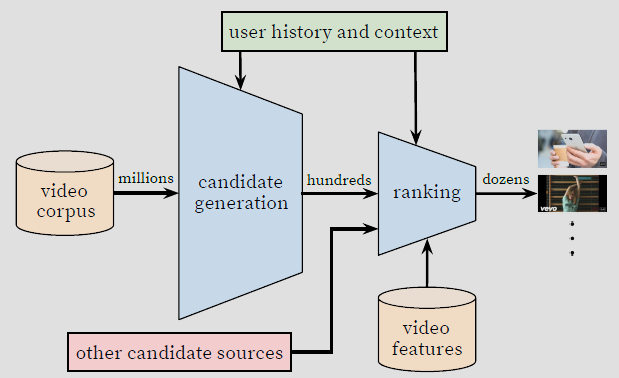
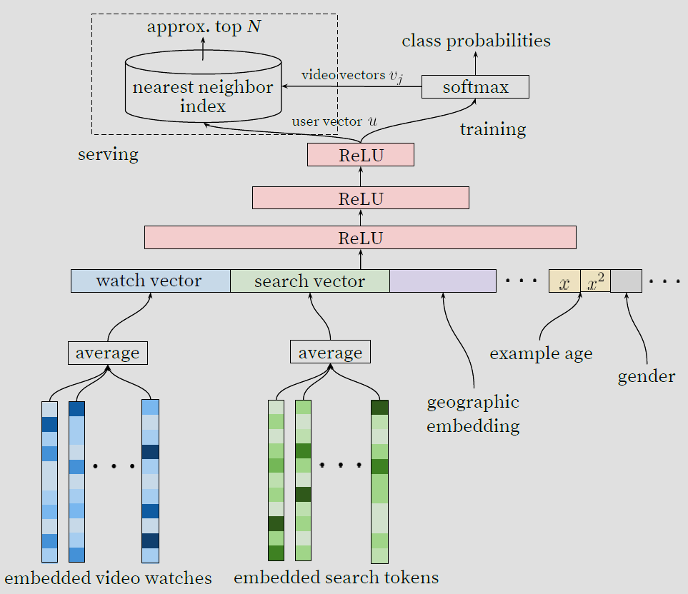
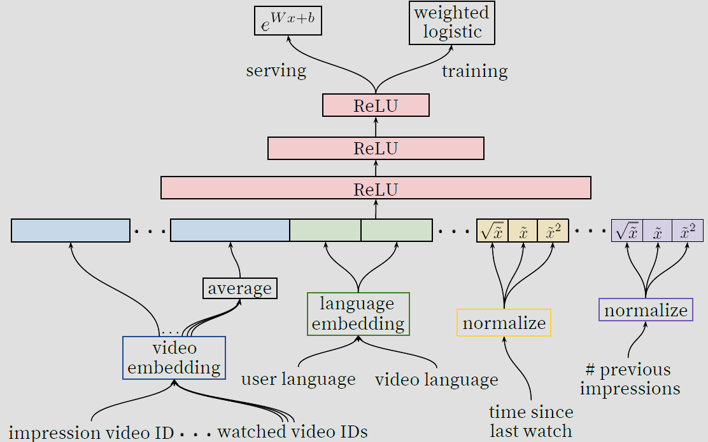
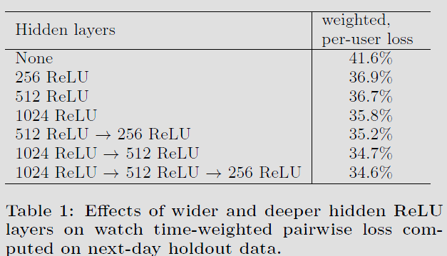
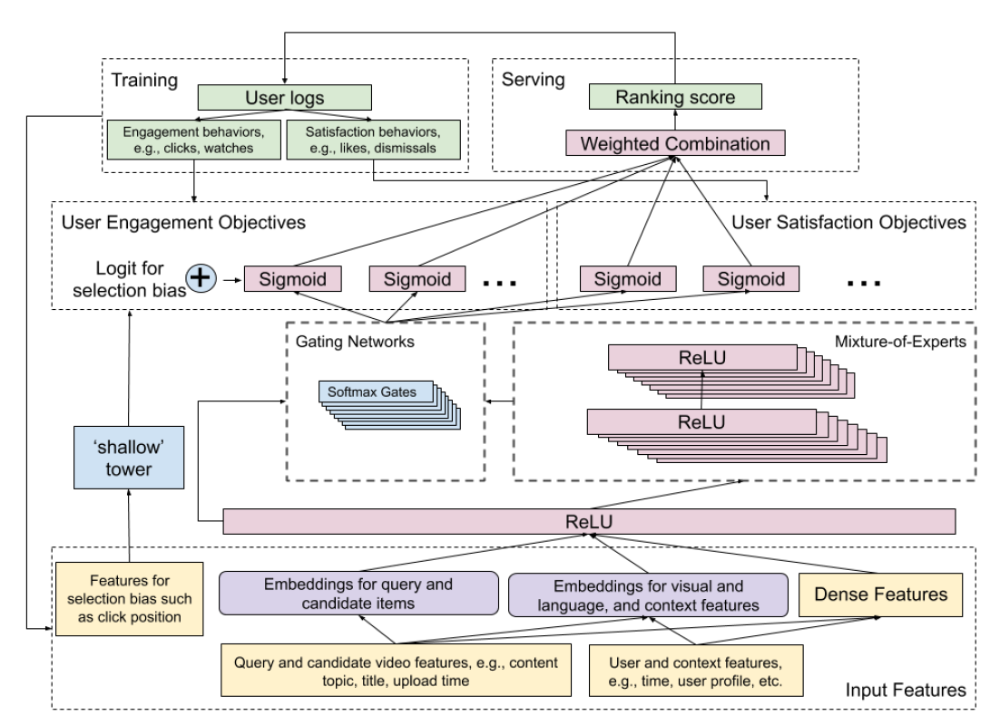
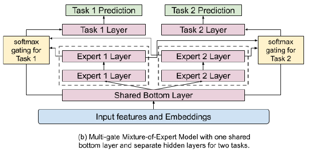

- [Recommender Systems](#recommender-systems)
  - [Embeddings](#embeddings)
    - [Representing Demographic Data](#representing-demographic-data)
  - [Candidate Generation](#candidate-generation)
    - [Content-based Filtering](#content-based-filtering)
    - [Collaborative Filtering](#collaborative-filtering)
    - [Deep Neural Network Based Recommendations](#deep-neural-network-based-recommendations)
    - [Two-tower Model](#two-tower-model)
    - [Candidate Retrieval](#candidate-retrieval)
    - [Negative Sampling](#negative-sampling)
    - [Evaluation](#evaluation)
  - [Ranking](#ranking)
    - [Point-wise Methods](#point-wise-methods)
    - [Pair-wise Methods](#pair-wise-methods)
    - [List-wise Methods](#list-wise-methods)
    - [Position/Selection Bias in Scoring](#positionselection-bias-in-scoring)
    - [Production Model](#production-model)
  - [Re-ranking](#re-ranking)
    - [Freshness](#freshness)
    - [Diversity](#diversity)
    - [Fairness](#fairness)
    - [Personalization](#personalization)
  - [Calibration](#calibration)
  - [Recommendation Systems Architectures](#recommendation-systems-architectures)
    - [Deep Neural Network Models for Recommendations](#deep-neural-network-models-for-recommendations)
    - [Wide and Deep (2016)](#wide-and-deep-2016)
      - [What are the Challenges in Learning Feature Crosses?](#what-are-the-challenges-in-learning-feature-crosses)
      - [Motivation](#motivation)
      - [Architecture](#architecture)
        - [Input to the Wide Component](#input-to-the-wide-component)
        - [Input to the Deep Component](#input-to-the-deep-component)
    - [Deep Factorization Machine / DeepFM (2017)](#deep-factorization-machine--deepfm-2017)
    - [Neural Collaborative Filteing / NCF (2017)](#neural-collaborative-filteing--ncf-2017)
      - [Deep and Cross Netoworks / DCN (2017)](#deep-and-cross-netoworks--dcn-2017)
    - [AutoInt (2019)](#autoint-2019)
    - [DLRM (2019)](#dlrm-2019)
    - [DCN V2 (2020)](#dcn-v2-2020)
      - [Music Use Case](#music-use-case)
    - [DHEN (2022)](#dhen-2022)
    - [GDCN (2023)](#gdcn-2023)
    - [Graph Neural Networks-based RecSys Architectures](#graph-neural-networks-based-recsys-architectures)
    - [Two Towers in RecSys](#two-towers-in-recsys)
- [经典论文阅读](#经典论文阅读)
  - [Deep Neural Networks for YouTube Recommendations](#deep-neural-networks-for-youtube-recommendations)
  - [Recommending What Video to Watch Next: a Multitask Ranking System](#recommending-what-video-to-watch-next-a-multitask-ranking-system)
  - [Modeling Task Relationships in Multi-task Learning with Multi-gate Mixture-of-Experts](#modeling-task-relationships-in-multi-task-learning-with-multi-gate-mixture-of-experts)
  - [Real-time Personalization using Embeddings for Search Ranking at Airbnb](#real-time-personalization-using-embeddings-for-search-ranking-at-airbnb)
- [参考](#参考)

# Recommender Systems

Here is a common architecture for a recommendation systems model:

- Candidate Generation: This is where the model starts from. It has a huge corpus and generates a smaller subset of candidates.
For e.g., Netflix has thousands of movies, but it has to pick which ones to show you on your home page!
The model needs to evaluate the queries at a rapid speed on a large corpus and keep in mind, a model may provide multiple candidate generators which each having different candidate subsets.
- Scoring: This is the next step in our architecture. Here, we simply rank the candidates in order to select a set of documents.
Here the model runs on a smaller subset of documents, so we can aim for higher precision in terms of ranking.
- Re-ranking: The final step in our model is to re-rank the recommendations.
For e.g., if the user explicitly dislikes some movies, Netflix will need to move those out of the main page.

## Embeddings

### Representing Demographic Data

- Approaches for generating user embeddings from demographics:
  - One-hot encoding: Simple but causes sparsity.
  - Embedding layers: Maps attributes to lower dimensions, capturing non-linear relationships.
  - Pretrained embeddings: Leverage semantic relationships from large corpora.
  - Autoencoders: Learn compressed representations via neural networks.
- Choose based on data characteristics and availability of training data.

## Candidate Generation

There are two common candidate generation approaches:

1. Content-based filtering: Uses similarity between content to recommend new content.
For e.g., if user watches corgi videos, the model will recommend more corgi videos.
2. Collaborative filtering: Uses similarity between queries (2 or more users) and items (videos, movies) to provide recommendations.
   - For e.g., if user $A$ watches corgi videos and user $A$ is similar to user $B$ (in demographics and other areas), then the model can recommend corgi videos to user $B$ even if user $B$ has never watched a corgi video before.

| Method | Content-based Filtering | Collaborative Filtering |
| ---- | ---- | ---- |
| Pros | 1. Model does not need data about other users, only needs info for the current user. Makes it easier to scale;   2. Can recommend niche items to each user, items that other users may not be interested in. | We don’t need to have prior domain knowledge as the embeddings are automatically learned. |
| Cons | 1. Requires a lot of domain knowledge as the features are hand-engineered. Thus, the model is only as good as the hand-engineered features;   2.  Model will only make recommendations based on existing interests of the user and is not able to expand on their interests. | Cold start problem: If the item/document has not been seen during training, our model can not create an embedding from it and can not query the model for this item.   - Mean Normalization can help with this, as we see below. Another solution is to show some reasonable items to the new users and have them rate a few items.   - You can also use the user’s information (demographics, expressed preferences, web browser they are using, their IP) to recommend them reasonable items. |

### Content-based Filtering

Content-based filtering is a type of recommendation system that suggests items to users based on the similarity between the features of items and the user’s preferences. In other words, it recommends items that are similar to items that a user has liked or interacted with in the past.

### Collaborative Filtering

Collaborative filtering is a type of recommendation system that suggests items to users based on the similarities and patterns in the behavior of a group of users. In other words, it recommends items that users with similar preferences have liked or interacted with.

The goal of a collaborative filtering recommender system is to generate two vectors:
- A ‘parameter vector’ for each user that embodies the item’s tastes of a user.
- A feature vector for each item which embodies some description of the movie.
- The dot product of the two vectors plus the bias term should produce an estimate of the rating the user might give to that movie.

### Deep Neural Network Based Recommendations

- One common approach for DNN-based recommendation is to use a matrix factorization model as a baseline and then incorporate additional layers of neural networks to capture more complex patterns in the user-item interactions. This is known as a deep matrix factorization model. The neural network layers can be used to learn non-linear transformations of the input features, which can improve the accuracy of the recommendations.
- Another popular approach for DNN-based recommendation is to use a sequence modeling architecture, such as a recurrent neural network (RNN) or a transformer network. These models can capture temporal dependencies in user behavior and item popularity, allowing for more accurate and personalized recommendations. For example, an RNN can be used to model the sequence of items that a user has interacted with over time, and then use this information to predict which item the user is likely to interact with next.

### Two-tower Model

- Many online platforms, like YouTube, Facebook, and TikTok, use the two-tower Model in their recommender systems.
- This process is as follows:
  - The two-tower model consists of two sub-neural networks: query and item.
  - The query tower encodes user data; the item tower encodes product data.
  - The output of each tower is an embedding, i.e., a dense vector.
  - The similarity of a user and product pair is measured using the dot product.
  - The trained embeddings of query and item towers are stored for fast retrieval.

### Candidate Retrieval

- Now that you have an embedding model, how would you decide which items to recommend given a user?
- At serve time, given a query, you start by doing one of the following:
  - For a matrix factorization model, the query (or user) embedding is known statically, and the system can simply look it up from the user embedding matrix.
  - For a DNN model, the system computes the query embedding $ψ(x)$
 at serve time by running the network on the feature vector $x$.
- Once you have the query embedding $q$, search for item embeddings $V_j$ that are close to $q$ in the embedding space. This is a nearest neighbor problem. Practically, [approximate nearest neighbor](https://aman.ai/primers/ai/ann-similarity-search) algorithms are used to tackle this aspect. For example, you can return the top $k$ items according to the similarity score $s(q,Vj)$.” 

### Negative Sampling

- During training, negative sampling involves randomly selecting items that the user has not interacted with and assigning them negative labels to represent disinterest or lack of preference. This helps balance the dataset and provides a more representative view of user preferences.
  
### Evaluation

Some commonly used metrics are:
- Precision: Precision measures the percentage of relevant items among the recommended items. In the context of candidate generation, precision measures how many of the recommended candidates are actually relevant to the user’s preferences.
- Recall: Recall measures the percentage of relevant items that were recommended. In the context of candidate generation, recall measures how many of the relevant candidates were recommended to the user.
- F1 Score: F1 Score is the harmonic mean of precision and recall. It provides a balance between precision and recall and is a good overall metric for evaluating candidate generation performance.
- Mean Average Precision (mAP): MAP measures the average precision across different queries. In the context of candidate generation, MAP measures the average precision of the recommended candidates across all the users.
Normalized Discounted Cumulative Gain (NDCG): NDCG measures the relevance of the recommended items by assigning higher scores to items that are more relevant. In the context of candidate generation, NDCG measures how well the recommended candidates are ranked according to their relevance.

## Ranking

LTR (Learning to Rank) methods aim to predict the probability that a user will interact with an item, given their previous interactions and other contextual information. LTR methods can be classified into three categories: (i) point-wise, (ii) pair-wise, and (iii) list-wise methods.

### Point-wise Methods

- Point-wise methods evaluate items independently, ignoring the rank order of the other items. A simple point-wise method is to use a linear model, such as logistic regression, to score each item based on a set of features.
- Gradient Boosted Trees (GBT) is a pointwise ranking algorithm that is commonly used for recommender systems. GBT is an ensemble method that combines multiple decision trees to make predictions. It is based on gradient descent optimization and aims to optimize a ranking metric such as NDCG.
- GBT works by iteratively training decision trees on the negative gradients of the loss function. The negative gradients represent the direction in which the loss function decreases the most. The decision trees are trained to predict the negative gradients, and the predictions are added to the current model predictions to update the ranking scores.

### Pair-wise Methods

- Pair-wise methods compare items in pairs, and the goal is to learn a function that assigns a higher score to the preferred item in each pair.
- Pairwise approaches in learning to rank focus on pairs of documents in the loss function. Given a pair of documents, the goal is to determine the optimal order for that pair and compare it to the ground truth. The objective for the ranker is to minimize the number of inversions in ranking, which occur when the pair of results are in the wrong order compared to the ground truth.
- Pairwise approaches are preferred over pointwise approaches in practice because predicting the relative order of documents is more in line with the nature of ranking than predicting a class label or relevance score. Many of the most popular Learning to Rank algorithms, such as RankNet, LambdaRank, and LambdaMART, are based on pairwise approaches.

### List-wise Methods

- List-wise methods treat the ranked list of items as a whole and optimize a scoring function that directly maps from the item set to a ranking score.
- Listwise approaches in Learning to Rank directly examine the entire list of documents and attempt to determine the optimal ordering for it. There are two main sub-techniques for implementing listwise Learning to Rank.
  - Normalized Discounted Cumulative Gain (NDCG), which is a commonly used measure of ranking quality. This technique is used by algorithms such as SoftRank and AdaRank.
  - minimizing a loss function that is defined based on an understanding of the unique properties of the ranking being targeted. For example, ListNet and ListMLE are algorithms that use this technique.

### Position/Selection Bias in Scoring

- Items that appear lower on the screen are less likely to be clicked than items appearing higher on the screen. However, when scoring videos, the system usually doesn’t know where on the screen a link to that video will ultimately appear.

### Production Model

- As an example, a production model (for say, CTR prediction for an ad on a page) with a 4 layer multi-layer perceptron (MLP) with dimensions of 512, 128, 64, and 16 with ReLU activation function and BatchNorm applied to all layers is as shown below.

- This model is fed with the concatenation of textual, numerical, and categorical features.
  - The textual features are converted to dense representation by:
    - Tokenizing the input.
    - Generating hash value for each token.
    - Using the hash value to lookup corresponding embedding from the embedding table, and
    - Performing mean-pool operation on the retrieved embedding vectors to generate a single dense representation for the text (e.g., the title of the product page).
  - The categorical features (e.g., page category) are converted to a one-hot encoding and the corresponding embedding is retrieved from a randomly initialized embedding table.
- All the aforementioned features are concatenated and added as input to the MLP model with the click/non-click binary label and trained with binary cross entropy loss function.

## Re-ranking

- In this re-ranking stage, the system can consider additional factors beyond the initial scoring, such as the diversity of items within the recommended set. For example, the system may choose to penalize the score of items that are too similar to each other, in order to encourage a more diverse set of recommendations.
- Re-ranking is a popular technique in recommender systems used to improve the quality of recommendations by adjusting the order in which items are presented to users. There are several different ways to approach re-ranking, including through the use of filters, modifications to the score returned by the ranker, or adjustments to the order of recommended items.
- One approach to re-ranking in a recommender system involves using filters to remove certain candidates from consideration. For example, in a video recommender, one could train a separate model to detect click-bait videos, and then run this model on the initial candidate list. Videos that the model classifies as click-bait could then be removed from consideration.
Another approach to re-ranking involves manually transforming the score returned by the initial ranker. For example, in a video recommender, one could modify the score as a function of video age or length to promote fresher or shorter content. This can be done in addition to the initial scoring phase or after the initial ranking has been performed.

### Freshness

- One way to re-rank recommendations is to consider the freshness of items. This approach involves promoting newer items to the top of the list, which can be useful in contexts where users are more interested in up-to-date information or news.
- Freshness-based re-ranking can be implemented using various algorithms, such as Bayesian personalized ranking (BPR) or matrix factorization (MF), and can be combined with other techniques like content-based filtering to improve the diversity of recommendations.

### Diversity

- Another way to re-rank is based on diversity. This is important because users often have varying preferences, and simply presenting them with the most popular or highly-rated items can lead to a lack of variety.
- Diversity-based re-ranking algorithms can include techniques like clustering, where similar items are grouped together and presented in a balanced way to users.
- Some viable way to incorporate diversity are:
  - “Train multiple candidate generators using different sources.
  - Train multiple rankers using different objective functions.
  - Re-rank items based on genre or other metadata to ensure diversity.” (source), the user will likely lose interest.

### Fairness

- Fairness is also an important consideration in recommender systems, as they should strive to provide equal opportunity for all users, regardless of factors like age, gender, or location.
- Re-ranking algorithms that prioritize fairness might consider factors like equal representation of different categories or user demographics, or optimizing for equal coverage of different parts of the item space.
- Some viable options to include fairness are:
  - “Include diverse perspectives in design and development.
  - Train ML models on comprehensive data sets. Add auxiliary data when your data is too sparse (for example, when certain categories are under-represented).
  - Track metrics (for example, accuracy and absolute error) on each demographic to watch for biases.
  - Make separate models for underserved groups.” (source)

### Personalization

Personalization-based re-ranking algorithms often rely on machine learning techniques like collaborative filtering or reinforcement learning to learn user preferences and adjust recommendations accordingly.

- Methods to include personalization:
  - Collaborative Filtering: This technique uses the user’s history of interactions and preferences to recommend items that are similar to those previously liked by the user. Collaborative filtering is commonly used in re-ranking to personalize recommendations for each user by considering their previous interactions with the system.
  - Content-Based Filtering: This technique uses item features and attributes to recommend items that are similar to the ones that the user has interacted with previously. Content-based filtering can be used in re-ranking to personalize recommendations based on the user’s preferences and interests.
  - Contextual Bandits: This technique is a form of reinforcement learning that can be used for online learning and decision making. Contextual bandits can be used in re-ranking to personalize recommendations based on the user’s context, such as the time of day, location, or device.
  - Hybrid Recommender Systems: These systems combine multiple recommendation techniques to provide personalized recommendations to users. Hybrid recommender systems can be used in re-ranking to combine the strengths of different techniques and provide more accurate and personalized recommendations.

## Calibration

There are several techniques that can be used for calibration in recommender systems, including: 
1. Platt Scaling: Platt scaling is a popular calibration technique that involves fitting a logistic regression model to the predicted scores and the true labels. The logistic regression model learns a transformation function to map the predicted scores to calibrated probabilities. 
2. Isotonic Regression: Isotonic regression is another calibration method that models the relationship between the predicted scores and the observed outcomes using a non-decreasing function. It fits a piecewise constant, monotonic function to the predicted scores to obtain calibrated probabilities. 
3. Bayesian Calibration: Bayesian calibration approaches incorporate prior knowledge about the distribution of user preferences to adjust the predicted scores. Bayesian methods can provide more flexible and adaptive calibration by taking into account the uncertainty in the model predictions.

We might balance the dataset by downsampling negatives, use ranking loss or perform hard negative mining. All of which will distort the output of the model. However, down-stream tasks including rank score, ads market place etc often assumes calibrated probabilities.

There are two common methods for probability calibration: Platt Scaling and Isotonic Regression. (https://lnkd.in/dJ469b-z). Platt Scaling is most effective when the distortion in the predicted probabilities is sigmoid-shaped already.

## Recommendation Systems Architectures

Recommender systems typically deal with two kinds of features: dense and sparse. Dense features are continuous real values, such as movie ratings or release years. Sparse features, on the other hand, are categorical and can vary in cardinality, like movie genres or the list of actors in a film.

The architectural transformation of these features in RecSys models can be broadly divided into two parts:

- Dense Features (Continuous / real / numerical values):
  - Movie Ratings: This feature represents the continuous real values indicating the ratings given by users to movies. For example, a rating of 4.5 out of 5 would be a dense feature value.
  - Movie Release Year: This feature represents the continuous real values indicating the year in which the movie was released. For example, the release year 2000 would be a dense feature value.
- Sparse Features (Categorical with low or high cardinality):
  - Movie Genre: This feature represents the categorical information about the genre(s) of a movie, such as “Action,” “Comedy,” or “Drama.” These categorical values have low cardinality, meaning there are a limited number of distinct genres.
  - Movie Actors: This feature represents the categorical information about the actors who starred in a movie. These categorical values can have high cardinality, as there could be numerous distinct actors in the dataset.

In the model architecture, **the dense features like movie ratings and release year can be directly fed into a feed-forward dense neural network.** The dense network performs transformations and computations on the continuous real values of these features.

On the other hand, the sparse features like movie genre and actors require a different approach. Each of the sparse, high-dimensional categorical features are first converted into a low-dimensional, dense real-valued vector, often referred to as an embedding vector. The dimensionality of the embeddings are usually on the order of O(10) to O(100). **The embedding network maps each sparse feature value (e.g., genre or actor) to a low-dimensional dense vector representation called an embedding.**

The figure below illustrates a deep neural network (DNN) architecture for processing both dense and sparse features: dense features are processed through an MLP (multi-layer perceptron) to create dense embeddings, while sparse features are converted to sparse embeddings via separate embedding tables (A and B). These embeddings are then combined to facilitate dense-sparse interactions before being fed into the DNN architecture to produce the output.

### Deep Neural Network Models for Recommendations

- Pros: Capable of learning complex, non-linear relationships between inputs. Can handle a variety of feature types. Suitable for both candidate generation and fine ranking.
- Cons: Can be computationally expensive and require a lot of data to train effectively. Might overfit on small datasets. The inner workings of the model can be hard to interpret (“black box”).
- Use case: Best suited when you have a large dataset and require a model that can capture complex patterns and interactions between features.

### Wide and Deep (2016)

#### What are the Challenges in Learning Feature Crosses?

- In web-scale applications, data is mostly categorical, leading to large and sparse feature space. Identifying effective feature crosses in this setting often requires manual feature engineering or exhaustive search.
- Traditional feed-forward multilayer perceptron (MLP) models are universal function approximators; however, they cannot efficiently approximate even 2nd or 3rd-order feature crosses ([Wang et al. (2020)](https://arxiv.org/pdf/2008.13535.pdf), [Beutel et al. (2018)](https://static.googleusercontent.com/media/research.google.com/en//pubs/archive/18fa88ad519f25dc4860567e19ab00beff3f01cb.pdf)).

#### Motivation

Wide and Deep learning jointly train wide linear models and deep neural networks – to combine the benefits of memorization and generalization for recommender systems. Wide linear models can effectively memorize sparse feature interactions using cross-product feature transformations, while deep neural networks can generalize to previously unseen feature interactions through low dimensional embeddings.

#### Architecture

> **Wide part**: The wide part of the model is a generalized linear model that takes into account cross-product feature transformations, in addition to the original features. The cross-product transformations capture interactions between categorical features. For example, if you were building a real estate recommendation system, you might include a cross-product transformation of city=San Francisco AND type=condo. These cross-product transformations can effectively capture specific, niche rules, offering the model the benefit of memorization.

> **Deep part**: The deep part of the model is a feed-forward neural network that takes all features as input, both categorical and continuous. However, categorical features are typically transformed into embeddings first, as neural networks work with numerical data. The deep part of the model excels at generalizing patterns from the data to unseen examples, offering the model the benefit of generalization.

##### Input to the Wide Component

- The wide component would primarily use sparse, categorical features, possibly transformed to capture specific interactions:
  - User Features: Demographics (age, gender, location), user ID, historical user behavior (e.g., genres listened to frequently, favorite artists).
  - Music Item Features: Music genre, artist ID, album ID, release year.
  - Cross-Product Transformations: Combinations of categorical features that are believed to interact in meaningful ways. For instance, “user’s favorite genre = pop” AND “music genre = pop”, or “user’s location = USA” AND “artist’s origin = USA”. These cross-products help capture interaction effects that are specifically relevant to music recommendations.

##### Input to the Deep Component

- The deep component would use both dense and sparse features, with sparse features transformed into dense embeddings:
  - User Features (as Embeddings): Embeddings for user ID, embedding vectors for historical preferences (like a vector summarizing genres listened to), demographics if treated as categorical.
  - Music Item Features (as Embeddings): Embeddings for music genre, artist ID, album ID. These embeddings capture the nuanced relationships in the music domain.
  - Additional Dense Features: If available, numerical features like the number of times a song has been played, user’s average listening duration, or ratings given by the user.
    - The embeddings created to serve as the input to the Dense component are “learned embeddings” or “trainable embeddings,” as they are learned directly from the data during the training process of the model.

### Deep Factorization Machine / DeepFM (2017)

Similar to Google’s DCN, Huawei’s [DeepFM](https://arxiv.org/abs/1703.04247), introduced in Guo et al. (2017), also replaces manual feature engineering in the wide component of Wide and Deep with a dedicated neural network that learns cross features. However, unlike DCN, the wide component is not a cross neural network, but instead a so-called factorization machine (FM) layer.

> What does the FM layer do? It simply takes the dot-products of all pairs of embeddings. For example, if a movie recommender takes 4 id-features as inputs, such as user id, movie id, actor ids, and director id, then the FM layer computes 6 dot products, corresponding to the combinations user-movie, user-actor, user-director, movie-actor, movie-director, and actor-director. The output of the FM layer is then concatenated with the output of the deep component and passed into a sigmoid layer which outputs the model’s predictions.

- Pros: 
  - DeepFM combines FM with deep neural networks. It utilizes FM to model pairwise feature interactions and a deep neural network to capture higher-order feature interactions. This architecture leverages both linear and non-linear relationships between features.
- Cons:
  - DeepFM creates feature crosses in a brute-force way, simply by considering all possible combinations. This is not only inefficient, it could also create feature crosses that aren’t helpful at all, and just make the model overfit.
  - Increased model complexity and potential challenges in training and optimization.

### Neural Collaborative Filteing / NCF (2017)

The integration of deep learning into recommender systems witnessed a significant breakthrough with the introduction of Neural Collaborative Filtering (NCF), introduced in [He et. al (2017)](https://arxiv.org/abs/1708.05031) from NUS Singapore, Columbia University, Shandong University, and Texas A&M University.

> The key idea behind NCF is to substitute the inner product in matrix factorization with a neural network architecture to that can learn an arbitrary non-linear function from data. To supercharge the learning process of the user-item interaction function with non-linearities, they concatenated user and item embeddings, and then fed them into a multi-layer perceptron (MLP) with a single task head predicting user engagement, like clicks. Both MLP weights and embedding weights (which user/item IDs are mapped to) were learned through backpropagation of loss gradients during model training.

#### Deep and Cross Netoworks / DCN (2017)

- Wide and Deep has proven the significance of cross features, however it has a huge downside: the cross features need to be manually engineered, which is a tedious process that requires engineering resources, infrastructure, and domain expertise.
- The key idea of Deep and Cross Networks (DCN), introduced in a [Wang et al. (2017)](https://arxiv.org/abs/1708.05123) by Google is to replace the wide component in Wide and Deep with a “cross neural network”, a neural network dedicated to learning cross features of arbitrarily high order. However, note that DCN (similar to DeepFM) learns this in a brute-force manner simply by considering all possible combinations uniformly (i.e., it calculates all pair-wise interactions), while newer implementations such as AutoInt leverage self-attention to automatically determine the most informative feature interactions, i.e., which feature interactions to pay the most attention to (and which to ignore by setting the attention weights to zero).

- By contrast, in the cross neural network the next layer is constructed by forming second-order combinations of the first layer with itself: $x_{l+1}=x_0x_l^{\intercal}w_l+b_l+xl$
- The unified wide and cross model architecture is training jointly with mean squared error (MSE) as it’s loss function.

- **Pros**: Captures explicit high-order feature interactions and non-linear relationships through cross layers, allowing for improved modeling of complex patterns.
- **Cons**:
  - DCN creates feature crosses in a brute-force way, simply by considering all possible combinations. This is not only inefficient, it could also create feature crosses that aren’t helpful at all, and just make the model overfit.
More complex than simple feed-forward networks.
May not perform well on tasks where feature interactions aren’t important.
Increased model complexity, potential overfitting on sparse data.

### AutoInt (2019)

- Proposed in [AutoInt: Automatic Feature Interaction Learning via Self-Attentive Neural Networks](https://arxiv.org/abs/1810.11921) by Song et al. from from Peking University and Mila-Quebec AI Institute, and HEC Montreal in CIKM 2019.
- AutoInt employs a multi-head self-attentive neural network with residual connections, designed to explicitly model feature interactions in a 16-dimensional embedding space. It overcomes the limitations of prior models by focusing on relevant feature combinations, avoiding unnecessary and unhelpful feature crosses.

### DLRM (2019)

Let’s fast-forward by a year to Meta’s DLRM (“deep learning for recommender systems”) architecture, proposed in [Naumov et al. (2019)](https://aman.ai/recsys/architectures/](https://arxiv.org/abs/1906.00091)), another important milestone in recommender system modeling.

- Compared to other DL-based approaches to recommendation, DLRM differs in two ways. First, it computes the feature interactions explicitly while limiting the order of interaction to pairwise interactions. Second, DLRM treats each embedded feature vector (corresponding to categorical features) as a single unit, whereas other methods (such as Deep and Cross) treat each element in the feature vector as a new unit that should yield different cross terms. These design choices help reduce computational/memory cost while maintaining competitive accuracy.

### DCN V2 (2020)

- Proposed in [DCN V2: Improved Deep & Cross Network and Practical Lessons for Web-scale Learning to Rank Systems](https://arxiv.org/abs/2008.13535) by Wang et al. from Google, DCN-V2 is an enhanced version of the Deep & Cross Network (DCN), designed to effectively learn feature interactions in large-scale learning to rank (LTR) systems.
- The paper addresses DCN’s limited expressiveness in learning predictive feature interactions, especially in web-scale systems with extensive training data.
- DCN-V2 is focused on the efficient and effective learning of predictive feature interactions, a crucial aspect of applications like search recommendation systems and computational advertising. It tackles the inefficiency of traditional methods, including manual identification of feature crosses and reliance on deep neural networks (DNNs) for higher-order feature crosses.
- The core of DCN-V2 is its cross layers, which explicitly create feature crosses. These layers are based on a base layer with original features, utilizing learned weight matrices and bias vectors for each cross layer.

- As shown in the figure below, DCN-V2 employs a novel architecture that combines a cross network with a deep network. This combination is realized through two architectures: a stacked structure where the cross network output feeds into the deep network, and a parallel structure where outputs from both networks are concatenated. The cross operation in these layers is represented as $x_{l+1}=x_0 \bigodot(W_lx_l+b_l)+x_l$.

> A key feature of DCN-V2 is the use of low-rank techniques to approximate feature crosses in a subspace, improving performance and reducing latency. This is further enhanced by a Mixture-of-Expert architecture, which decomposes the matrix into multiple smaller sub-spaces aggregated through a gating mechanism.

#### Music Use Case

- Creating a music recommender system using DCN V2 involves several steps, from data preparation to model deployment. Here’s a detailed use case illustrating how DCN V2 can be effectively utilized for this purpose:

- Data Collection and Preparation:
  - Collect Data: Gather comprehensive data involving user interactions with music tracks. This data might include:
    - User Data: User demographics, historical listening data, ratings, and preferences.
    - Music Data: Track IDs, genres, artists, albums, release years, and other metadata. 
  - Feature Engineering:
    - Categorical Features: User IDs, track IDs, artist names, genres (sparse features).
    - Numerical Features: User listening duration, frequency of listening to certain genres or artists (dense features).
- Model Architecture Setup:
  - Embedding Layer for Sparse Features:
    - Convert sparse categorical features into dense embeddings. For instance, create embeddings for user IDs and track IDs. 
    - Deep Component of DCN V2:
      - Set up a series of dense layers for processing both dense features and embeddings from the sparse features. 
    - Cross Component of DCN V2:
      - Implement the cross network with a mixture of low-rank cross layers to efficiently model explicit feature interactions. 
    - Stacked or Parallel Structure:
      - Choose between a stacked or parallel architecture based on exploratory analysis and experimentation.
- Model Training:
  - Input Data: Process and feed the data into the model, including user-track interaction data.
  - Training Process:
    - Train the model using appropriate loss functions (e.g., categorical cross-entropy for multi-class classification of music tracks).
    - Employ techniques like batch normalization, dropout, or regularization as needed to improve performance and reduce overfitting.
- Generating Music Recommendations:
  - Model Prediction: For a given user, use the model to predict the likelihood of them enjoying various tracks.
  - Recommendation Strategy:
    - Generate a list of recommended tracks for each user based on predicted likelihoods.
    - Consider personalizing recommendations based on user-specific data like historical preferences.
- Model Evaluation and Refinement:
  - Evaluation Metrics: Use accuracy, precision, recall, F1-score, or more complex metrics like Mean Average Precision at K (MAP@K) for evaluation.
  - Feedback Loop: Incorporate user feedback to refine and improve the model iteratively.
- Deployment and Scaling:
  - Deployment: Deploy the model in a production environment where it can handle real-time recommendation requests.
  - Scalability: Ensure the system is scalable to handle large numbers of users and tracks, leveraging the efficiency of the DCN V2 architecture.
- Example Use Case:
  - Personalized Playlist Creation: For each user, the system generates a personalized playlist based on their unique preferences, historical listening habits, and interactions with different music tracks.
  - New Music Discovery: The system recommends new tracks and artists that the user might enjoy but hasn’t listened to yet, broadening their music experience.

- Using DCN V2 for a music recommender system leverages the model’s ability to understand both explicit and implicit feature interactions, offering a powerful tool for delivering personalized music experiences. Its efficient architecture makes it suitable for handling the complexity and scale of music recommendation tasks.

### DHEN (2022)

- Proposed in [DHEN: A Deep and Hierarchical Ensemble Network for Large-Scale Click-Through Rate Prediction](https://arxiv.org/abs/2203.11014), this paper by Zhang et al. from Meta introduces DHEN (Deep and Hierarchical Ensemble Network), a novel architecture designed for large-scale Click-Through Rate (CTR) prediction. 
- The following figure from the paper shows a two-layer two-module hierarchical ensemble (left) and its expanded details (right). A general DHEN can be expressed as a mixture of multiple high-order interactions. Dense feature input for the interaction modules are omitted in this figure for clarity.
- In CTR prediction tasks, the feature inputs usually contain discrete categorical terms (sparse features) and numerical values (dense features). DHEN uses the same feature processing layer in DLRM, which is shown in the figure below. The sparse lookup tables map the categorical terms to a list of “static” numerical embeddings. Specifically, each categorical term is assigned a trainable $d$-dimensional vector as its feature representation. On the other hand, the numerical values are processed by dense layers.

### GDCN (2023)

### Graph Neural Networks-based RecSys Architectures

- Graph Neural Networks (GNN) architectures utilize graph structures to capture relationships between users, items, and their interactions. GNNs propagate information through the user-item interaction graph, enabling the model to learn user and item representations that incorporate relational dependencies. This is particularly useful in scenarios with rich graph-based data.
  - Pros: Captures relational dependencies and propagates information through graph structures, enabling better modeling of complex relationships.
  - Cons: Requires graph-based data and potentially higher computational resources for training and inference.
  - Advantages: Improved recommendations by incorporating the rich relational information among users, items, and their interactions.
  - Example Use Case: Social recommendation systems, where user-user connections or item-item relationships play a significant role in personalized recommendations.

### Two Towers in RecSys

- “One of the more popular architecture in personalization / RecSys is two tower network. The two towers of the network usually represent user tower ($U$) and candidate tower ($C$). The towers produce a dense vector (embedding representation) of $U$ and $C$ respectively. The final network is just a dot product or cosine similarity function.
- Let’s consider the cost of executing user tower/network is $u$ and cost of executing candidate tower is $c$ and dot product is $d$. At request time, the cost of executing the whole network for ranking N candidates for one user: $N*(u+c+d)$.
- Since the user is fixed, you need to compute it only once. So, the cost becomes: $u+N*(c+d)$. Embeddings could be cached. So, the final cost becomes $u+N*d+k$ when $k$ is.”

- The two-tower architecture consists of two separate branches: a query tower and a candidate tower. The query tower learns user representations based on user history, while the candidate tower learns item representations based on item features. The two towers are typically combined in the final stage to generate recommendations.
  - Pros: Explicitly models user and item representations separately, allowing for better understanding of user preferences and item features.
  - Cons: Requires additional computation to learn and combine the representations from the query and candidate towers.
  - Advantages: Improved personalization by learning user and item representations separately, which can capture fine-grained preferences.
  - Example Use Case: Personalized recommendation systems where understanding the user’s historical behavior and item features separately is critical.
  - Phase: Candidate Generation, Ranking.
  - Recommendation Workflow: The two-tower architecture is often employed in the candidate generation and ranking phases. In the candidate generation phase, the two-tower architecture enables the separate processing of user and item features, capturing their respective representations. In the ranking phase, the learned representations from the query and candidate towers are combined to assess the relevance of candidate items to the user’s preferences.
- The two-tower model consists of two separate “towers”: one for learning relevance (user/item interactions) and another for learning biases (like position bias). These towers are combined in different ways – either multiplicatively or additively – to yield the final output.
- Examples of popular two-tower implementations: 
  - Huawei’s PAL model uses a multiplicative approach to combine the outputs of the two towers, addressing position bias within the context of their app store.
  - YouTube’s “Watch Next” paper introduced an additive two-tower model, which not only addresses position bias but also incorporates other selection biases by using additional features like device type.

# 经典论文阅读

| Paper | Affiliation | Key Takeaways |
| ---- | ---- | ---- |
| [Deep Neural Networks for YouTube Recommendations](https://static.googleusercontent.com/media/research.google.com/en//pubs/archive/45530.pdf) (RecSys 2016) | YouTube | How Youtube uses embeddings for candidate generation |
| [Recommending What Video to Watch Next: a Multitask Ranking System](https://daiwk.github.io/assets/youtube-multitask.pdf) (2019) | Youtube | Youtube's multitask learner for ranking |
| [Adaptive Mixtures of Local Experts](http://www.cs.utoronto.ca/~hinton/absps/jjnh91.ps) (1991) | MIT | | 
| [Modeling Task Relationships with Multi-task Learning with Multi-gate Mixture-of-Experts](https://dl.acm.org/doi/pdf/10.1145/3219819.3220007) (2018) | Google | |
| [Instagram Explorer Recommendation System](https://instagram-engineering.com/powered-by-ai-instagrams-explore-recommender-system-7ca901d2a882)  |  Instagram |  |
| [Pinterest Pixie](https://medium.com/pinterest-engineering/an-update-on-pixie-pinterests-recommendation-system-6f273f737e1b) (2018 blog post) | Pinterest |  |
| [Real-time Personalization using Embeddings for Search Ranking at Airbnb](https://dl.acm.org/doi/abs/10.1145/3219819.3219885) (KDD 2018) | Airbnb | |
| [Behavior Sequence Transformer for E-commerce Recommendation in Alibaba](https://arxiv.org/pdf/1905.06874.pdf) | Alibaba | |
| [Deep Reinforcement Learning for Online Advertising in Recommender Systems](https://arxiv.org/pdf/1909.03602.pdf) | TikTok | |
| [Neural Collaborative Filtering](https://arxiv.org/pdf/1708.05031) (WWW 2017) | | |
| [Collaborative Memory Network for Recommendation Systems](https://arxiv.org/pdf/1804.10862) (SIGIR 2018) | | |

## Deep Neural Networks for YouTube Recommendations

- **主要贡献点**
- **背景**
  - Youtube的视频推荐面临三个主要的挑战：
    - `体量(Scale)大`：视频量大，用户多
    - `新鲜度(Freshness)的需求`：需要平衡高质量视频和新近更新的视频之间的推荐频率
    - `噪音（Noise）`：用户行为稀疏且多样，而且推荐的结果大部分都不能得到显式的反馈，而是充满噪音的隐式反馈（比如观看时长，点赞等）
  - 推荐可以分为两个阶段：
    - **候选生成（candidate generation）**
      - `Goal`：一定的个性化推荐
      - `Input`: 用户行为历史
      - `Output`：一个小的视频集合 (hundreds)
      - `Features`：用户视频浏览历史，搜索词，人口统计学特征等
    - **排序（ranking）**
      - `Goal`：对候选生成阶段获取的视频集合进行打分
      - `Input`：候选生成获取的视频集合
      - `Output`：带分数的视频集合，一般输出最高分的商品作为结果返回
      - `Features`：用户特征，商品特征
- **线下评估**
  - Precision
  - Recall
  - Ranking loss
- **线上评估**
  - A/B testing
  - click-through rate, watch time, etc.

- **候选生成 Candidate Generation**
  - 这里把推荐问题看做是一个多分类问题（multiclass classification），预测在时间$t$基于当前用户$U$和上下文$C$对从视频库$V$里选出的一个特定视频的观看时长$w_t$。其中，$u\in \mathbb{R}^N$表示用户和上下文的embedding，而$v_j\in \mathbb{R}^N$表示每个候选视频的embedding。
    - $P(w_t=i|U,C)=\frac{e^{v_i u}}{\sum_{j\in V}e^{v_j u}}$
- **候选采样 candidate sampling**
  - Sample negative classes from the background distribution and then correct for this sampling via importance weighting.
  - For each example, the cross-entropy loss is minimized for the true label and the sampled negative classes.
  - Serveral thousand negatives are sampled, corresponding to more than 100 times speedup over traditional softmax.
  - At serving time, compute the most likely $N$ classes (videos) in order to choose the top $N$ to represent to the user. 
  - Since calibrated likelihoods from the softmax output layer are not needed at serving time, the scoring problem reduces to a nearest neighbor search in the dot product space.

- **模型**
  - 简单来说，把用户的观看历史（一堆稀疏的视频ID）映射到稠密的embeddings，平均以后得到用户的观看embedding。同样的，用户的搜索历史在经过tokenizer之后，平均得到用户的搜索embedding。另外，还可以考虑用户的人口统计学特征（地区，设备，性别，登录状态，年龄等）。把所有特征连接起来，形成一个第一层（wide first layer），然后再经过若干层ReLU（Rectified Linear Units）。
  - 样本年龄 Example Age
    - 一般来说，机器学习模型会天然地偏向很早以前上传的视频，因为有更多的互动历史，但是作为一个视频网站，YouTube需要推荐新上传的内容。
    - 因此，在训练时，把样本（视频）的年龄也作为一个特征送入模型。在预测时，这个特征设置为0，或者是一个很小的负数。
  -  排序 Ranking
     -  特征提取 Feature Representation
        -  特征分为categorical和continuous/ordinal特征。同时，把特征分类为impression特征（有关item的）和query特征（有关用户的）。query特征只需要在per request计算一次，而impression特征需要每个item计算一次。
        -  据观察，最有用的特征是描述该用户与当前item或者类似item的历史交互信息，比如用户看过该item所在频道的多少个视频，上一次用户看相关主题的视频是什么时候。另外，历史impression的频率也是个有效的特征，比如用户之前被推荐过某视频，但是他没有点积，那么之后会降低这个视频的推荐概率。

        - 建模类别特征（Embedding Categorical Features）
        - 正则化连续特征（normalizing Continuous Features）
        - 神经网络对输入的scaling和distribution比较敏感，因此需要对连续特征做适当的正则化
        - 连续特征最终会被映射到[0,1)的范围
        - 除了常规正则化$\tilde{x}$，还会引入$\tilde{x}^2$和$\sqrt{\tilde{x}}$
        - 建模预期观看时长（Modeling Expected Watch Time）
     - 排序的目标是为了预测预期观看时长，我们通过`weighted logistic regression`模型来预测时长

- **实验结果**
  - 结果显示增加隐层的宽度和深度都有助于提升效果，但是考虑到线上serving的CPU时间，实际配置采用1024-wide ReLU + 512-wide ReLU + 256-wide ReLU。

## Recommending What Video to Watch Next: a Multitask Ranking System 

- Multi-task Learning
  - Multiple objectives
    - engagement objectives: clicks, degree of engagement with recommended videos
    - satisfaction objects: likes, leave a rating on the recommendation
  - Reduce selection bias (e.g., position bias), add a shallow tower to the main model
- Challenges
  - Multimodal feature space
  - Scalability
- Problem Formulation
  - We model our ranking problem as a combination of classification problems and regression problems with multiple objectives.
  - Given a query, candidate, and context, the ranking model predicts the probabilities of user taking actions such as clicks, wathces, likes, and dismissals.
  - Tasks
    - binary classification tasks: cross entropy loss
    - regression tasks: squared loss
- Architecture
  - Multi-gate Mixture-of-Experts (MMoE)
    - a soft-parameter sharing model structure to model task conflicts and relations
    - It adapts the Mixture-of-Experts (MoE) structure to multitask learning by having the xperts shared across all tasks, while also having a gating network trained for each task.

## Modeling Task Relationships in Multi-task Learning with Multi-gate Mixture-of-Experts

- Shared-bottom model may not perform well due to task differences and the relationships between tasks.

## Real-time Personalization using Embeddings for Search Ranking at Airbnb

- List embeddings for short-term real-time personalization
  - Given a set $S$ of $s$ clicked sessions obtained from $N$ users, where each session $s=(l_1, ..., l_M)\in S$ is defined as an uninterrupted sequence of $M$ listing ids that were clicked by the user. A new session is started whenever there is a time gap of more than 30 minutes between two consecutive user clicks.
  - Given this dataset, the aim is to learn a $d$-dimensional real-valued representations $v_{l_i}\in \mathbb{R}^d$ of each unique listing $l_i$, such that similar listings lie nearby in the embedding space.
  - The objective of the model is to learn listing representations using the skip-gram model by maximizing the objective function $L$ over the entire set $S$ of search sessions, defined as $L=\sum_{s\in S}\sum_{l_i\in s}(\sum_{-m\geq j\leq m, i\neq 0}log\mathbb{P}(l_{i+j}|l_i))$
- User-type & listing type embeddings for long-term personalization 
  - embeddings trained on bookings
  - To tackle the sparsity of user actions (bookings), we propose to train embeddings at a level of user type, instead of a particular user id, where type is determined using many-to-one rule-based mapping that leverages known user attributes.
  - At the same time, we learn listing type embeddings in the same vector space as user type embeddings. 

# 参考

- [Aman.ai Recommendation Systems](https://aman.ai/recsys/index.html)
- [工业界的推荐系统](https://github.com/wangshusen/RecommenderSystem)