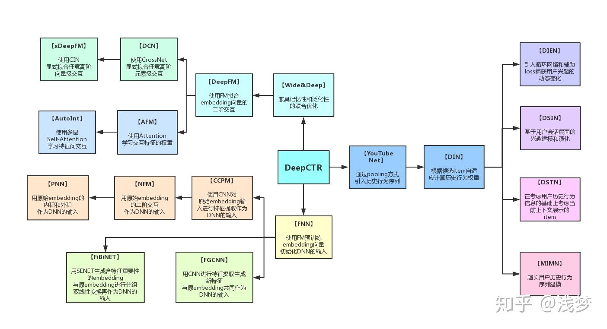

<!-- MarkdownTOC autoanchor="true" autolink="true" -->

- [主流CTR模型演化](#%25E4%25B8%25BB%25E6%25B5%2581ctr%25E6%25A8%25A1%25E5%259E%258B%25E6%25BC%2594%25E5%258C%2596)
	- [深度CTR模型的基本框架](#%25E6%25B7%25B1%25E5%25BA%25A6ctr%25E6%25A8%25A1%25E5%259E%258B%25E7%259A%2584%25E5%259F%25BA%25E6%259C%25AC%25E6%25A1%2586%25E6%259E%25B6)
	- [主流算法](#%25E4%25B8%25BB%25E6%25B5%2581%25E7%25AE%2597%25E6%25B3%2595)
		- [逻辑回归 Logistic Regression](#%25E9%2580%25BB%25E8%25BE%2591%25E5%259B%259E%25E5%25BD%2592-logistic-regression)
		- [LR + GBDT](#lr--gbdt)
		- [Deep Interest Network \(DIN\)](#deep-interest-network-din)
			- [贡献点](#%25E8%25B4%25A1%25E7%258C%25AE%25E7%2582%25B9)
			- [用户行为](#%25E7%2594%25A8%25E6%2588%25B7%25E8%25A1%258C%25E4%25B8%25BA)
		- [FM/FFM](#fmffm)
			- [FM](#fm)
			- [FFM \(Field-aware Factorization Machine\)](#ffm-field-aware-factorization-machine)
		- [GBDT+\(LR,FM,FFM\)](#gbdtlrfmffm)
		- [DNN](#dnn)
		- [Embedding+MLP](#embeddingmlp)
		- [Wide&Deep](#widedeep)
		- [DeepFM](#deepfm)
		- [DCN: Deep & Cross Network](#dcn-deep--cross-network)
		- [xDeepFM](#xdeepfm)
		- [DIN](#din)
	- [代码实现](#%25E4%25BB%25A3%25E7%25A0%2581%25E5%25AE%259E%25E7%258E%25B0)
		- [LR实现](#lr%25E5%25AE%259E%25E7%258E%25B0)
- [工程问题](#%25E5%25B7%25A5%25E7%25A8%258B%25E9%2597%25AE%25E9%25A2%2598)
	- [线上serving](#%25E7%25BA%25BF%25E4%25B8%258Aserving)
- [评价指标](#%25E8%25AF%2584%25E4%25BB%25B7%25E6%258C%2587%25E6%25A0%2587)
	- [COPC](#copc)
	- [AUC](#auc)
	- [Logloss](#logloss)
	- [GAUC](#gauc)

<!-- /MarkdownTOC -->


<a id="%25E4%25B8%25BB%25E6%25B5%2581ctr%25E6%25A8%25A1%25E5%259E%258B%25E6%25BC%2594%25E5%258C%2596"></a>
# 主流CTR模型演化

CTR预估本质是一个二分类问题，以移动端展示广告推荐为例，依据日志中的用户侧的信息（比如年龄，性别，国籍，手机上安装的app列表）、广告侧的信息（广告id，广告类别，广告标题等）、上下文侧信息（渠道id等），去建模预测用户是否会点击该广告。





<a id="%25E6%25B7%25B1%25E5%25BA%25A6ctr%25E6%25A8%25A1%25E5%259E%258B%25E7%259A%2584%25E5%259F%25BA%25E6%259C%25AC%25E6%25A1%2586%25E6%259E%25B6"></a>
## 深度CTR模型的基本框架

典型的深度CTR模型可以分成以下四个部分：输入、特征嵌入（Embedding）、特征交互（有时候也称为特征提取）和输出。

- **输入**

输入通常包含若干个<特征ID, 特征值>对，当然也可以One-Hot Encoding展开。

- **特征嵌入（Embedding）**

在CTR任务中数据特征呈现高维、稀疏的特点，假设特征数为N，直接将这些特征进行One-Hot Encoding构造二阶及以上特征时候会产生巨大的参数数量，以FM的二阶项为例子，如一万个特征，两两构造二阶特征时将会产生一亿规模的特征权重参数。

Embedding可以减小模型复杂度，具体过程如下：

通过矩阵乘法将1\*N的离散特征向量通过维度为N\*k的参数矩阵W压缩成1\*k的低维度稠密向量，通常k<<N，参数从N^2降到N\*k。

- **特征交互**

经过特征嵌入可以获得稠密向量，在特征交互模块中设计合理的模型结构将稠密向量变成标量，该模块直接决定模型的质量好坏。

- **输出**

将特征交互模块输出的标量用sigmoid函数映射到[0, 1]，即表示CTR。


<a id="%25E4%25B8%25BB%25E6%25B5%2581%25E7%25AE%2597%25E6%25B3%2595"></a>
## 主流算法

<a id="%25E9%2580%25BB%25E8%25BE%2591%25E5%259B%259E%25E5%25BD%2592-logistic-regression"></a>
### 逻辑回归 Logistic Regression

LR一直是CTR预估的benchmark模型，具有简单、易于并行化实现、可解释性强等优点，但是LR模型中的特征是默认相互独立的，遇到具有交叉可能性的特征需进行大量的人工特征工程进行交叉(连续特征的离散化、特征交叉)，不能处理目标和特征之间的非线性关系。LR将特征加权求和并经sigmoid即得到CTR值。


<a id="lr--gbdt"></a>
### LR + GBDT

GBDT(Gradient Boost Decision Tree)是用来解决LR模型的特征组合问题。GBDT可以用来学习高阶非线性特征组合。对应树的一条路径。通常将一些连续值特征、值空间不大的categorical特征都丢给GBDT模型；空间很大的ID特征留在LR模型中训练，既能做高阶特征组合又可以利用线性模型易于处理大规模稀疏数据的优势。


GBDT优势在于处理连续值特征，如用户历史点击率、用户历史浏览次数等连续值。由于树的分裂算法，具有一定组合特征的能力。GBDT根据最优的分裂特征和该特征的最优分裂点，根据特征的分裂次数得到一个特征的重要性排序，GBDT减少了人工特征工程的工作量。

但是大多数推荐系统中出现的是大规模的离散化特征，使用GBDT需要首先统计成连续值特征(embedding)，需要耗费时间，GBDT具有记忆性强的特点，不利于挖掘长尾特征。而且GBDT虽然具有一定组合特征能力，但是组合的能力十分有限，远不能与DNN相比。

<a id="deep-interest-network-din"></a>
### Deep Interest Network (DIN)

用户场景很简单，就是在一个电商网站或APP找那个给用户推荐广告。

注意力机制，就是模型在预测的时候，对用户不同行为的注意力是不一样的。


<a id="%25E8%25B4%25A1%25E7%258C%25AE%25E7%2582%25B9"></a>
#### 贡献点

- 用GAUC代替AUC
- 用Dice方法代替经典的PReLU激活函数
- 介绍一种Adaptive的正则化方法


<a id="%25E7%2594%25A8%25E6%2588%25B7%25E8%25A1%258C%25E4%25B8%25BA"></a>
#### 用户行为


<a id="fmffm"></a>
### FM/FFM

<a id="fm"></a>
#### FM

与LR相比，FM增加了二阶项的信息，通过穷举所有的二阶特征（一阶特征两两组合）并结合特征的有效性（特征权重）来预测点击结果，FM的二阶特征组合过程可拆分成Embedding和内积两个步骤。GBDT虽然可以学习特征交叉组合，但是只适合中低度稀疏数据，容易学到高阶组合。但是对于高度稀疏数据的特征组合，学习效率很低。另外GBDT也不能学习到训练数据中很少或者没有出现的特征组合。但是FM（因子分解机，Factorization Machine）可以通过隐向量的内积提取特征组合，对于很少或没出现的特征组合也可以学习到。

FM的优点就是具有处理二次交叉特征的能力，而且可以实现线性复杂度O(n)，模型训练速度快。

<a id="ffm-field-aware-factorization-machine"></a>
#### FFM (Field-aware Factorization Machine)

FFM引入了field概念，FFM将相同性质的特种归于同一个field。同一个categorical特种经过one-hot编码生成的数值特种都可以放入同一个field。


FFM模型使用**logistic loss**作为损失函数+L2正则项：


FM是把所有特征都归属于一个field时的FFM模型。

**FFM模型训练时的注意事项**

- **样本归一化**。FFM默认是进行样本数据的归一化的 。若不进行归一化，很容易造成数据inf溢出，进而引起梯度计算的nan错误。因此，样本层面的数据是推荐进行归一化的。

- **特征归一化**。CTR/CVR模型采用了多种类型的源特征，包括数值型和categorical类型等。但是，categorical类编码后的特征取值只有0或1，较大的数值型特征会造成样本归一化后categorical类生成特征的值非常小，没有区分性。例如，一条用户-商品记录，用户为“男”性，商品的销量是5000个（假设其它特征的值为零），那么归一化后特征“sex=male”（性别为男）的值略小于0.0002，而“volume”（销量）的值近似为1。特征“sex=male”在这个样本中的作用几乎可以忽略不计，这是相当不合理的。因此，将源数值型特征的值归一化到[0,1]是非常必要的。

- **省略零值特征**。从FFM模型的表达式可以看出，零值特征对模型完全没有贡献。包含零值特征的一次项和组合项均为零，对于训练模型参数或者目标值预估是没有作用的。因此，可以省去零值特征，提高FFM模型训练和预测的速度，这也是稀疏样本采用FFM的显著优势。

<a id="gbdtlrfmffm"></a>
### GBDT+(LR,FM,FFM)

GBDT适合处理连续值特征，而LR、FM、FFM更加适合处理离散化特征。GBDT可以做到一定程度的特征组合，而GBDT的特征组合是多次组合而不仅是与FM和FFM这样的二阶组合而已。GBDT具备一定的特征选择能力（选择最优的特征进行分裂）。

<a id="dnn"></a>
### DNN

在ctr预估场景中，绝大多数特征都是大规模离散化特征，并且交叉类的特征十分重要，如果利用简单的模型如LR的话需要大量的特征工程，即使是GBDT，FM这种具有一定交叉特征能力的模型，交叉能力十分有限，脱离不了特征工程。

DNN具有很强的模型表达能力，有以下优势：

- 模型表达能力强，能够学习出高阶非线性特征。
- 容易扩充其他类别的特征，如特征是图片或文字类时。

<a id="embeddingmlp"></a>
### Embedding+MLP

多层感知机MLP因具有学习高阶特征的能力常常被用在各种深度CTR模型中。MLP主要由若干个全连接层和激活层组成。

<a id="widedeep"></a>
### Wide&Deep

将LR和MLP并联即可得到Wide&Deep模型，可同时学习一阶特征和高阶特征。

<a id="deepfm"></a>
### DeepFM 

DeepFM是为了解决DNN的不足而推出的一种并行结构模型。将LR、MLP和Quadratic Layer并联可得到DeepFM，注意到MLP和Quadratic Layer共享Group Embedding。DeepFM是目前效率和效果上都表现不错的一个模型。

<a id="dcn-deep--cross-network"></a>
### DCN: Deep & Cross Network

将LR、MLP和Cross Net并联可得到DCN。

Cross Net是一个堆叠型网络，该部分的初始输入是将f个(1,k)的特征组向量concat成一个(1,f\*k)的向量（不同特征组的嵌入维度可以不同，反正拼起来就对了）。

每层计算过程如下：输入向量和初始输入向量做Cartesian product得到(f\*k,f\*k)的矩阵，再重新投影成(1,k)向量，每一层输出都包含输入向量。

<a id="xdeepfm"></a>
### xDeepFM

将LR、MLP和CIN并联可得到xDeepFM。

CIN也是一个堆叠型网络，该部分的初始输入是一个(f,k)的矩阵，

每层计算过程如下：输入矩阵(Hi, k)和初始输入矩阵沿嵌入维度方向做Cartesian product得到(Hi, f, k)的三维矩阵，再重新投影成(Hi+1,k)矩阵。

CIN的最后一层：将CIN中间层的输出矩阵沿嵌入维度方向做sum pooling得到(H1,1),(H2,1)...(Hl,1)的向量，再将这些向量concat起来作为CIN网络的输出。

<a id="din"></a>
### DIN

该模型基于对用户历史行为数据的两个观察：1、多样性，一个用户可能对多种品类的东西感兴趣；2、部分对应，只有一部分的历史数据对目前的点击预测有帮助，比如系统向用户推荐泳镜时会与用户点击过的泳衣产生关联，但是跟用户买的书就关系不大。于是，DIN设计了一个attention结构，对用户的历史数据和待估算的广告之间部分匹配，从而得到一个权重值，用来进行embedding间的加权求和。


<a id="%25E4%25BB%25A3%25E7%25A0%2581%25E5%25AE%259E%25E7%258E%25B0"></a>
## 代码实现 

<a id="lr%25E5%25AE%259E%25E7%258E%25B0"></a>
### LR实现

SGD classifier分类器

```python
# Linear classifiers (SVM, logistic regression, etc.) with SGD training.
dict_one_hot_encoder = DictVectorizer(sparse=False)
X_train = dict_one_hot_encoder.fit_transform(X_dict_train)
sgd_log_reg_model = SGDClassifier(loss='log', penalty=None, fit_intercept=True, learning_rate='constant', eta0=0.01)
sgd_log_reg_model.fit(X_train, y_train)
predictions = sgd_log_reg_model.predict_proba(X_test)[:, 1]
score = roc_auc_score(y_test, predictions)
```

LR online learning

```python
sgd_log_reg_model = SGDClassifier(loss='log', penalty=None, fit_intercept=True, learning_rate='constant', eta0=0.01)
X_dict_train, y_train = process_data(100000)
dict_one_hot_encoder = DictVectorizer(sparse=False)
X_train = dict_one_hot_encoder.fit_transform(X_dict_train)
if load_model == True:
	l_reg_file = open('../models/logistic_regression_model_ol.sav', 'rb')
	sgd_log_reg_model = pickle.load(l_reg_file)
	X_dict_test, y_test_next = process_data(10000, (20 + 1) * 200000)  # n_samples, offset
	X_test_next = dict_one_hot_encoder.transform(X_dict_test)
	predict = sgd_log_reg_model.predict_proba(X_test_next)[:, 1]
	score = roc_auc_score(y_test_next, predict)
	return 0

# Train and partially fit on 1 million samples
for i in range(20):
	X_dict_train, y_train_every = process_data(100000, i * 100000)
	X_train_every = dict_one_hot_encoder.transform(X_dict_train)
	sgd_log_reg_model.partial_fit(X_train_every, y_train_every, classes=[0, 1])

X_dict_test, y_test_next = process_data(10000, (i + 1) * 200000)
X_test_next = dict_one_hot_encoder.transform(X_dict_test)

predict = sgd_log_reg_model.predict_proba(X_test_next)[:, 1]
score = roc_auc_score(y_test_next, predict)
l_reg_file = open('../models/logistic_regression_model_ol.sav', "wb")
pickle.dump(sgd_log_reg_model, l_reg_file)
l_reg_file.close()
```

<a id="%25E5%25B7%25A5%25E7%25A8%258B%25E9%2597%25AE%25E9%25A2%2598"></a>
# 工程问题

<a id="%25E7%25BA%25BF%25E4%25B8%258Aserving"></a>
## 线上serving


<a id="%25E8%25AF%2584%25E4%25BB%25B7%25E6%258C%2587%25E6%25A0%2587"></a>
# 评价指标

[Predictive Model Performance: Offline and Online Evaluations](https://chbrown.github.io/kdd-2013-usb/kdd/p1294.pdf)

**如何评价CTR预估效果？**

难度：

- 观察到的是点击或没点击的二元数据，但是要预估的是一个[0, 1]上的点击概率，换句话说就是没有绝对的ground truth；
- 各种机器学习模型训练完以后出来的分数，即使是LR，也不见得就是一个好的可以直接拿来当预估结果的概率；
- 观察数据往往是有偏的，观察到的广告展现和点击数据都是赢得竞价的那些。

常用评价指标是logloss和AUC。logloss更关注和观察数据的吻合速度，AUC更关注rank order，这两个指标适合线下评估。线上有更简单直接的评价方式：把线上的impression log按照预测的CTR从小到大排序，然后按照某个特点流量步长（比如每10000个impression）分桶，统计每个分桶的平均预估CTR（pCTR）和实际CTR（aCTR），把他俩的对比关系画出来，理想状态下应该是一条斜率为1的线。

线上的其他业务指标，比如点击率、营收、利润、eCPC等是不能给出CTR预估效果评价的。这些业务指标，受到整个广告系统其他模块，如bid optimization, budget pacing等其他外部竞价环境的综合影响。

CTR预估，需要解决三个问题：
- rank order；
- calibration；
- sample distribution reconstruction;

<a id="copc"></a>
## COPC

全称click over predicted click，copc=实际的点击率/模型预测的点击率，主要衡量整体预估的偏高和偏低，越接近1越好，一般情况下在1附近波动。


<a id="auc"></a>
## AUC

- 最好不要把所有流量合起来用AUC评估，因为无法区分广告点击率在哪些流量上预测得好或不好。
- 当AUC指标不好时，可以通过计算max AUC来验证是否是数据的问题，计算的方式是计算每一种特征组合的点击率，将这个点击率作为预测值计算AUC，计算出来的值是max AUC。
- 加入特征后（特征是user/context特征后），AUC的提升，上线后不一定会提升，因为离线评估计算的AUC是针对query与query之间的，而在线时，排序是针对ad与ad之间的。

<a id="logloss"></a>
## Logloss

对数损失（Log loss）亦被称为逻辑回归损失（Logistic regression loss）或交叉熵损失（Cross-entropy loss）。通常把模型关于单个样本预测值与真实值的差称为损失，损失越小，模型越好，而用于计算损失的函数称为损失函数。主要是评估距，但logloss在pCTR和CTR值比较近的时候（比如差个5%），区别比较小。

- Logloss对把正例预测的值很低，或是将负例的值预测得很高都会比较高的值，而将负例预测撑0.01，或者0.011，则区别不大。


<a id="gauc"></a>
## GAUC


